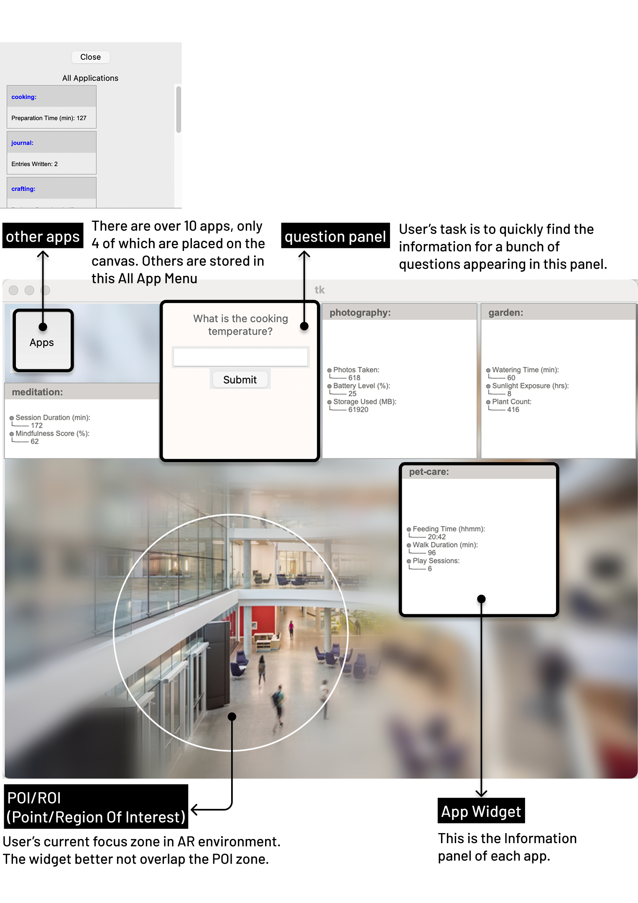
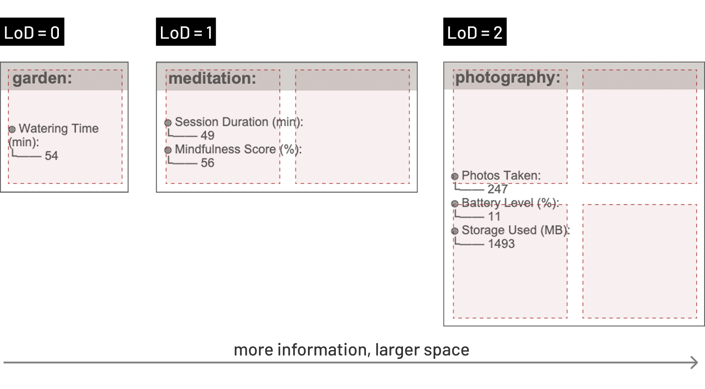
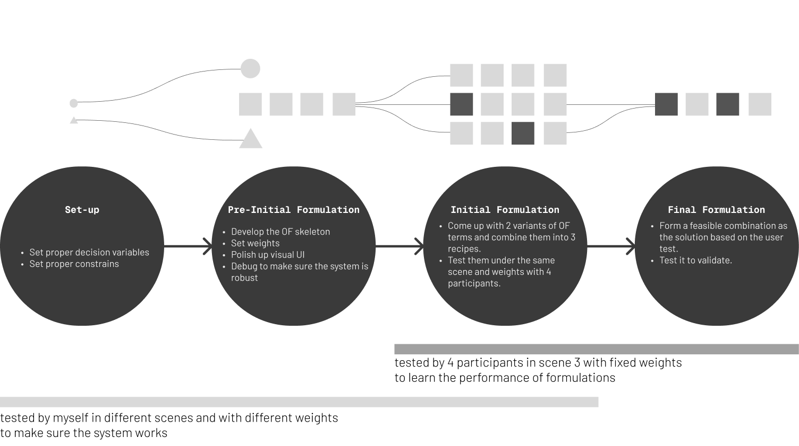
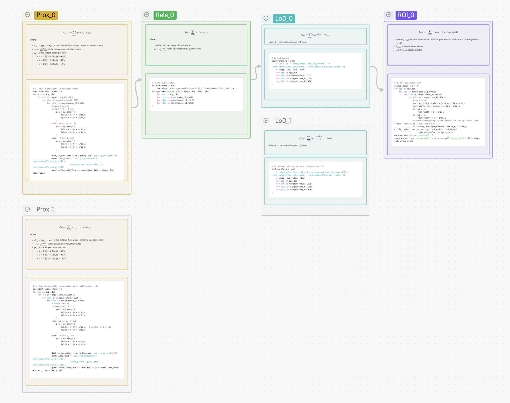
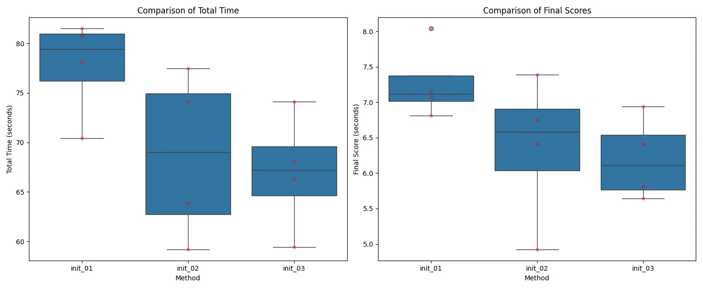
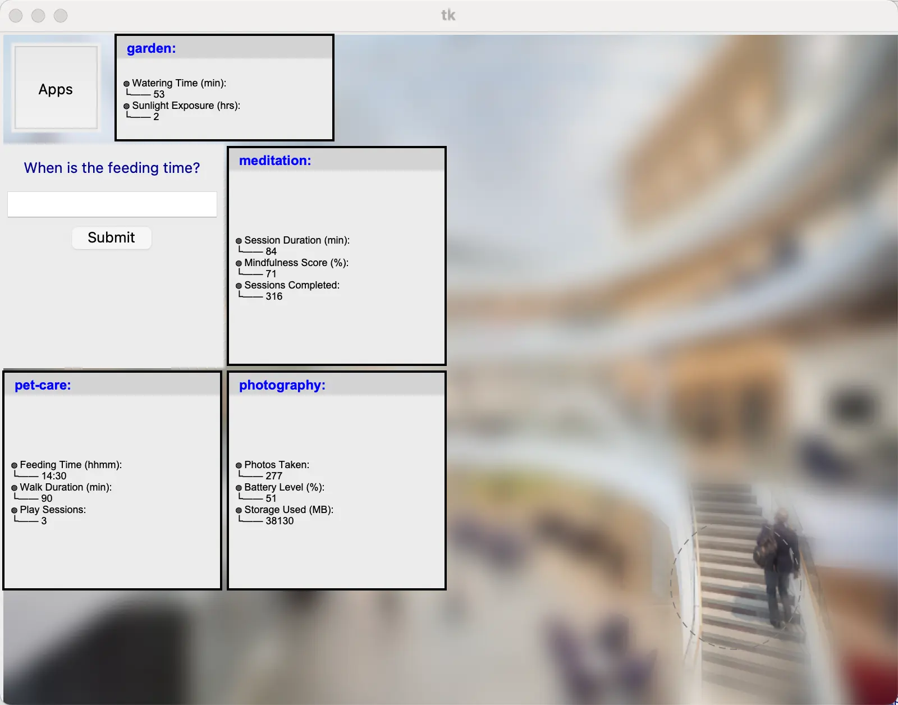
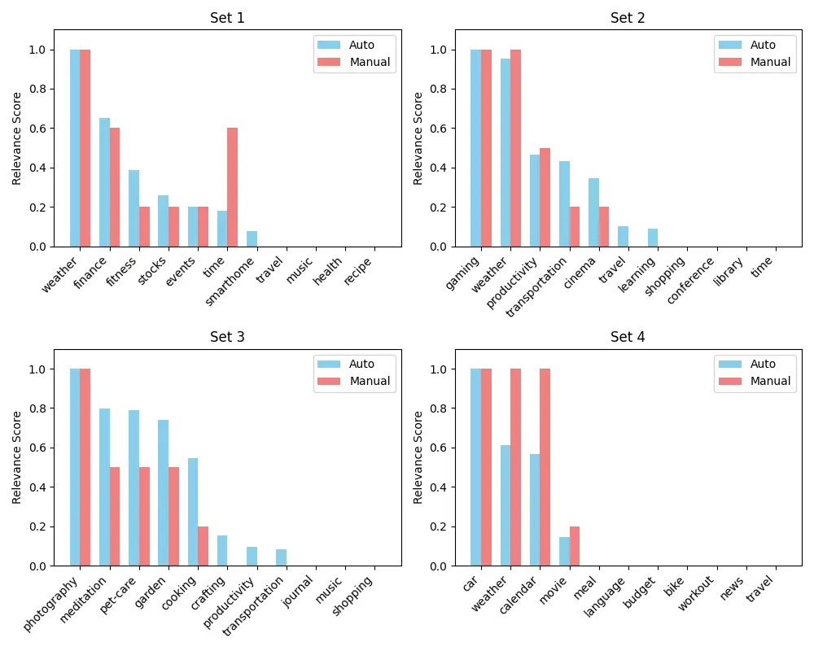
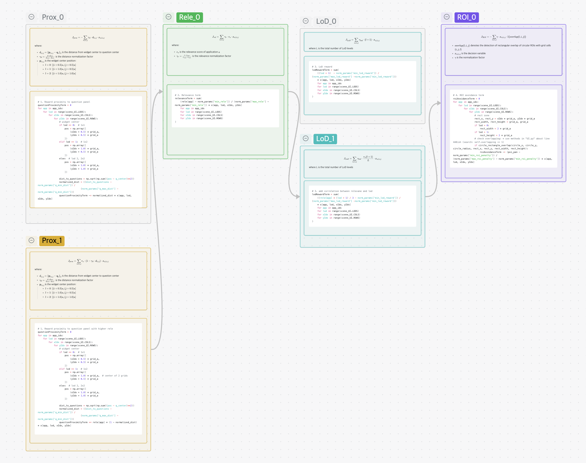

## 1. Background, Goal, and Workflow
Augmented Reality promises to transform how we interact with digital information. Through blending virtual interface elements into our physical environment, it enables a range of applications from in situ displays of task instructions for training purposes to immersive educational experiences. However, placing interface elements within our physical world also makes designing AR applications incredibly difficult as they should be "context-sensitive". For the lack of words, the "goodness" of interface designs now depends on the environmental conditions (e.g., what objects are around the user) as well as external (e.g., task) and internal (e.g., cognitive load) states. Hence, UI decisions can no longer be set deterministically at design time, but adapt according to their context of use at runtime. 

### 1.1 Project Goal


In this project which mimics the AR context in a low-fidelity prototype in python, I aim to present the application widgets more effectively using an optimization-based approach, taking into account:

〓 Constraints to make the UI placement looks normal:
- Non-overlap
- Place <= 4 elements
- Single placement per app

〓 Objectives to help users to efficiently find the information they need:
- Proximity to the starting point
- App relevance to the question
- LoD (Levels of Details) of each widget
- ROI (Region of Interest) of the scene

`Gurobipy` is used to solve the optimization problem.

<figure>

<figcaption>The components of the system interface: all the components are placed in a 2D plane</figcaption>
</figure>

Each widget has 3 levels of details (LoD), and the size of the widget is determined by the LoD.

<figure>

<figcaption>LoD: levels of details</figcaption>
</figure>


### 1.2 Workflow

<figure>



<figcaption>4 parts one build on another</figcaption>

</figure>


## 2. Setup
### 2.1 Decision Variables

Binary variable indicating whether app a is placed at grid position (i,j) with LoD

$$
 x_{a,l,i,j} \in \{0,1\} 
$$

### 2.2 Constraints

1. Non-overlap with fixed elements:  

$$ x_{a,l,i,j} = 0, \quad \forall (i,j) \in \mathcal{O} $$
	- where $\mathcal{O}$ is the set of positions that overlap with the question panel or Apps button

- Place <= 4 elements:  

$$
\sum_{a,l,i,j} x_{a,l,i,j} \leq 4
$$

- Single placement per app:  

$$
\forall a: \sum_{l,i,j} x_{a,l,i,j} \leq 1
$$

- Non-Overlap between widgets
    - LoD 0 occupies a 1×1 cell.
    - LoD 1 occupies a 1×2 area (extending to the right).
    - LoD 2 occupies a 2×2 area (extending to the right and downward).

$$
\sum_{a} ( x_{a,0,i,j} + \sum_{i'=i-1}^i x_{a,1,i',j} + \sum_{i'=i-1}^i \sum_{j'=j-1}^j x_{a,2,i',j'} ) \leq 1, \quad \forall i,j
$$


## 3. Iterations Before Initial Formulation

### 3.1 Constrains Iteration
#### 3.1.1 Widget-Defau1ltComponents Overlapping

- Before: did not consider the sizes of different widgets.

```bash
### in the loop ##
pos = np.array([xIdx*info["block_size"], yIdx*info["block_size"]]) 
# Check overlap with questions panel 
# Check overlap with Apps button
```

- After: The `positions` list is categorized and iterated through for widgets with various LoDs. 

```bash
### in the loop ##
positions = []
if lod == 0:
    positions = [(xIdx, yIdx)]
elif lod == 1:
    positions = [(xIdx, yIdx), (xIdx+1, yIdx)]
elif lod == 2:
    positions = [(xIdx, yIdx), (xIdx+1, yIdx),(xIdx, yIdx+1), (xIdx+1, yIdx+1)]
for pos_x, pos_y in positions:
pos = np.array([pos_x*grid_a, pos_y*grid_a])
# Check overlap with questions panel
# Check overlap with Apps button
```


### 3.2 UI visual optimization

- **Mimic AR focus zone by blurring the background** 
    - I used pillow to blur the background scene when keeping the attention focus zone clear to mimic the focus in Augmented Reality context.
- **Adaptive Color coding** 
    - I color coded titles and contents in widgets and add indents to organized the information hierarchy. The theme color is adaptive to the background scene by calculating the average color of the background.
- **Padding** 
    - I also added paddings to each widget to make them not stick to each other, hoping this can add more clarity.
  
## 4. Three Initial Formulations

### 4.1 Strategy

After the iteration and test before, I got 1 base initial formulations "Initial Formulation A", and developed 2 variants of it, including "Initial Formulation B" and "Initial Formulation C". Basically, for the 4 terms in objective function, I change the way to calculate some of them and apply to the original formulation to check if that can make sense.

For example, for the first term $J_{prox}$, I developed an alternative way to formulate it and name it "1" to distinguish it from the original method in the base initial formulation A, and applied it to formulation B. So the Formulation B is coded as "1000"

<figure>



<figcaption>Combinition of term variants in the objective function</figcaption>

</figure>


### 4.2 Variants

#### 4.2.1 Initial Formulation A: 0000

$$ 
\begin{align*}
\max_{x} \quad & w_{prox}J_{prox} + w_{rel}J_{rel} + w_{lod}J_{LoD} + w_{roi}J_{ROI} \\newline
\text{where:} \newline
J_{prox} &= -\sum_{a,l,i,j} \gamma_d \cdot d_{l,i,j} \cdot x_{a,l,i,j} \\newline
J_{rel} &= \sum_{a,l,i,j} \gamma_r \cdot r_a \cdot x_{a,l,i,j} \\newline
J_{LoD} &= \sum_{a,l,i,j} \gamma_{lod} \cdot (l + 1) \cdot x_{a,l,i,j} \\newline
J_{ROI} &= -\sum_{a,l,i,j} \gamma_{roi} \cdot x_{a,l,i,j} \cdot \mathbb{I}\{overlap(l,i,j)\}
\end{align*}
$$


###### Proximity_0

$$ 
J_{prox} = -\sum_{a,l,i,j} \gamma_d \cdot d_{l,i,j} \cdot x_{a,l,i,j}
$$

where:
- $d_{l,i,j} = \|\mathbf{p}_{l,i,j} - \mathbf{q}_c\|_2$ is the distance from widget center to question center
- $\gamma_d = \frac{d - d_{min}}{d_{max} - d_{min}}$ is the distance normalization factor
- $\mathbf{p}_{l,i,j}$ is the widget center position:
  - $l=0$: $[(i + 0.5)a, (j + 0.5)a]$
  - $l=1$: $[(i + 1.0)a, (j + 0.5)a]$
  - $l=2$: $[(i + 1.0)a, (j + 1.0)a]$


This term is to make all the widgets surrounded with the question panel.

###### Relevance_0

$$ 
J_{rel} = \sum_{a,l,i,j} \gamma_r \cdot r_a \cdot x_{a,l,i,j}
$$

where:
- $r_a$ is the relevance score of application $a$
- $\gamma_r = \frac{r - r_{min}}{r_{max} - r_{min}}$ is the relevance normalization factor, 1 here


This term prioritizes apps with higher relevance scores to show up.

###### LoD_0

$$ 
J_{LoD} = \sum_{a,l,i,j} \gamma_{lod} \cdot (l + 1) \cdot x_{a,l,i,j}
$$

where :
- $γ$ is the normalization factor


This term is set for using as large levels of details as possible when conditions permit.


###### ROI_0

$$ 
\begin{align*}
J_{ROI} = -\sum_{a,l,i,j} & \gamma \cdot x_{a,l,i,j} \cdot \mathbb{I}\{overlap(l,i,j)\} \newline
\end{align*}
$$

- $overlap(l,i,j)$ denotes the detection of rectangular overlap of circular ROIs with grid cells $(i,j,l)$
- $x_{a,l,i,j}$ is the decision variable
- $γ$ is the normalization factor


This term penalizes placements that fall within a sensitive region (ROI). The penalty linearly adds up with the overlapping girds counts adding up.

#### 4.2.2 Initial Formulation B: 1000

$$ 
\begin{align*}
\max_{x} \quad & w_{prox}J_{prox} + w_{rel}J_{rel} + w_{lod}J_{LoD} + w_{roi}J_{ROI} \newline
\text{where:} \newline
J_{prox} &= \sum_{a,l,i,j} r_a \cdot (1 - \gamma_d \cdot d_{l,i,j}) \cdot x_{a,l,i,j} \newline
J_{rel} &= \sum_{a,l,i,j} \gamma_r \cdot r_a \cdot x_{a,l,i,j} \newline
J_{LoD} &= \sum_{a,l,i,j} \gamma_{lod} \cdot (l + 1) \cdot x_{a,l,i,j} \newline
J_{ROI} &= -\sum_{a,l,i,j} \gamma_{roi} \cdot x_{a,l,i,j} \cdot \mathbb{I}\{overlap(l,i,j)\}
\end{align*}
$$


###### Proximity_1

$$ 
J_{prox} = \sum_{a,l,i,j} r_a \cdot (1 - \gamma_d \cdot d_{l,i,j}) \cdot x_{a,l,i,j}
$$

where:
- $d_{l,i,j} = \|\mathbf{p}_{l,i,j} - \mathbf{q}_c\|_2$ is the distance from widget center to question center
- $\gamma_d = \frac{d - d_{min}}{d_{max} - d_{min}}$ is the distance normalization factor
- $\mathbf{p}_{l,i,j}$ is the widget center position:
  - $l=0$: $[(i + 0.5)a, (j + 0.5)a]$
  - $l=1$: $[(i + 1.0)a, (j + 0.5)a]$
  - $l=2$: $[(i + 1.0)a, (j + 1.0)a]$


- goal: make questions with higher relevances nearer to the question panel
- I use `(1 - normalized_dist)` multiplied by the relevance of the app (`rele[app]`) to incentivize higher scores for apps that are both closer to the question area and have higher relevance. In this way, it still measures the negative correlation between the distance and the rewards, and also incorporate the relationship between relevance and distance.

#### 4.2.3 Initial Formulation C: 0010

$$ 
\begin{align*}
\max_{x} \quad & w_{prox}J_{prox} + w_{rel}J_{rel} + w_{lod}J_{LoD} + w_{roi}J_{ROI} \newline
\text{where:} \newline
J_{prox} &= -\sum_{a,l,i,j} \gamma_d \cdot d_{l,i,j} \cdot x_{a,l,i,j} \newline
J_{rel} &= \sum_{a,l,i,j} \gamma_r \cdot r_a \cdot x_{a,l,i,j} \newline
J_{LoD} &= \sum_{a,l,i,j} \gamma_{lod} \cdot \frac{r_a(l + 1)}{L} \cdot x_{a,l,i,j} \newline
J_{ROI} &= -\sum_{a,l,i,j} \gamma_{roi} \cdot x_{a,l,i,j} \cdot \mathbb{I}\{overlap(l,i,j)\}
\end{align*}
$$


###### LoD_1

$$ 
J_{LoD} = \sum_{a,l,i,j} \gamma_{lod} \cdot \frac{r_a(l + 1)}{L} \cdot x_{a,l,i,j}
$$

where L is the total number of LoD levels


- context：As the code background shows, Weather is with the highest relevance. It appears in the nearest position, which is quiet reasonable. But it is with the lowest LoD. This is a failed trade-off between proximity and LoD.
	- ![[viarant_3.webp|547]]
- goal: Enhancing the impact of relevance on LoDs
- To make widgets with higher relevance appear with higher LoDs, I coupled the relevance to LoD. To normalize, I also made a division of 3.

#### 4.3 Evaluation

I tweaked the weights for each term based on the Formulation A, and got a set of stable and balanced weights for the test of each variants:
- $w_{rel} = 3$ (relevance weight) 
- $w_{prox} = 5$ (proximity weight) 
- $w_{lod} = 3$ (LOD level weight) 
- $w_{roi} = -100$ (ROI avoidance weight, negative for penalty)

All the tests are under `scenes/scene-3.json`

I evaluated the 3 methods above based on the total time and scores. Generally, the diagram demonstrated the progress from the base Formulation A to B and C. 


<figure>



<figcaption>User testing data analysis</figcaption>

</figure>

Also, during the testing, I found there are some potential to combine the Formulation B and C. For example, in this screenshot form the user test with Formulation C, "photography" is with the highest relevance, but user first noticed other widget which is nearer to the question panel. If use Formulation "1010" as the final formulation, it is supposed to count into the correlation between relevance and proximity better.

<figure>



<figcaption>User testing screenshot with Formulation C: Although "photography" is marked as the most relevant, the user initially focused on a widget positioned closer to the question panel.</figcaption>

</figure>

## 5. Auto relevance calculation

The relevance values are currently manually defined. As a result, they may not actually reflect what information is needed for a particular scene. Using the scene.questions and scene.apps, can you automate relevance calculation? 

#### 5.1 method
Used the `kklearn` package to automatically calculate app relevance using text mining (TF-IDF, cosine similarity) instead of relying on preset values.

- Added a function `calculate_automated_relevance(scene)` :
	-  For each app, collects and cleans its description and name and combines this into a single text string.
	-  Combines all questions and associated app names into a single text string.
	-  Uses TF-IDF to convert the app text and questions text into numerical vectors. Computes cosine similarity between the app vector and questions vector to get a relevance score and normalize it.
- Added a toggle: When the flag `is_auto_rele` is `True`, relevance is calculated automatically; otherwise, `info["relevance"]` is used as before.

#### 5.2 evaluation


<figure>



<figcaption>Comparison between automatically calculated and manually labeled relevance assignment</figcaption>

</figure>


This approach makes sense. I've found that besides providing subtle scene-specific information, it can also reduce users' error correction costs. For example, as shown in the first diagram above, in the first scene, 'finance' and 'stock' are semantically similar - users sometimes confuse them. This semantic-based relevance assignment method means that when 'finance' appears in a question, 'stock' also gets higher relevance and is more likely to appear in easily visible positions. So even if users click the wrong one, they won't waste much time searching.

However, there are also issues. In the scene 1, time is not sensitive for semantic algorithm, but in the scene 2, every LoD of the 'travel' app contains the word 'time', so the algorithm considers it highly relevant to time-related queries, which is incorrect. Yet we can't simply treat 'time' as a stopword since it is indeed an important semantic term.

## 6. Final Formulation

<figure>



<figcaption>Final formulation recipe "1010"</figcaption>

</figure>

Since Formulation B and C perform better than Formulation A, so I combined them together as the final formulation and assumed it is good. To validate the assumption, I did a user test and logged the data.

<figure>


<figcaption>Comparison between automatically calculated and manually labeled relevance assignment</figcaption>

</figure>

It turned out that the final formulation has a good speed and stability. But my experiment is limited, because I found the generated plan of the widget often tends to show a really high level of detail, which does not violate the constrains neither the rewards and penalty. And a high LoD will contribute a lot to the final score since it could save a large amount of time by flattening the information to avoid hunting and finding required information in foggy jungles. However, real life condition is not a "speed competition", instead, more parameters like cognitive load should be considered. In another word, if cognitive load which is against LoD, it will be another story.

### 6.1 Objective function: 1010

$$ 
\begin{align*}
\max_{x} \quad & w_{prox}J_{prox} + w_{rel}J_{rel} + w_{lod}J_{LoD} + w_{roi}J_{ROI} \newline
\text{where:} \newline
J_{prox} &= \sum_{a,l,i,j} r_a \cdot (1 - \gamma_d \cdot d_{l,i,j}) \cdot x_{a,l,i,j} \newline
J_{rel} &= \sum_{a,l,i,j} \gamma_r \cdot r_a \cdot x_{a,l,i,j} \newline
J_{LoD} &= \sum_{a,l,i,j} \gamma_{lod} \cdot \frac{r_a(l + 1)}{L} \cdot x_{a,l,i,j} \newline
J_{ROI} &= -\sum_{a,l,i,j} \gamma_{roi} \cdot x_{a,l,i,j} \cdot \mathbb{I}\{overlap(l,i,j)\}
\end{align*}
$$


#### 6.1.1 Proximity_1

$$ 
J_{prox} = \sum_{a,l,i,j} r_a \cdot (1 - \gamma_d \cdot d_{l,i,j}) \cdot x_{a,l,i,j}
$$

where:
- $d_{l,i,j} = \|\mathbf{p}_{l,i,j} - \mathbf{q}_c\|_2$ is the distance from widget center to question center
- $\gamma_d = \frac{d - d_{min}}{d_{max} - d_{min}}$ is the distance normalization factor
- $\mathbf{p}_{l,i,j}$ is the widget center position:
  - $l=0$: $[(i + 0.5)a, (j + 0.5)a]$
  - $l=1$: $[(i + 1.0)a, (j + 0.5)a]$
  - $l=2$: $[(i + 1.0)a, (j + 1.0)a]$

```bash

# 1. Reward proximity to question panel with higher rele
questionProximityTerm = 0
for app in app_ids:
    for lod in range(scene_UI.LODS):
        for xIdx in range(scene_UI.COLS):
            for yIdx in range(scene_UI.ROWS):
                # widget center
                if lod == 0:  # 1x1
                    pos = np.array([
                        (xIdx + 0.5) * grid_a,  
                        (yIdx + 0.5) * grid_a
                    ])
                elif lod == 1:  # 1x2
                    pos = np.array([
                        (xIdx + 1.0) * grid_a,  # center of 2 grids
                        (yIdx + 0.5) * grid_a
                    ])
                else:  # lod 2, 2x2
                    pos = np.array([
                        (xIdx + 1.0) * grid_a,  
                        (yIdx + 1.0) * grid_a
                    ])
                
                dist_to_questions = np.sqrt(np.sum((pos - q_center)**2))
                normalized_dist = ((dist_to_questions - norm_params['q_min_dist']) / 
                                (norm_params['q_max_dist'] - norm_params['q_min_dist']))
                questionProximityTerm += rele[app] * (1 - normalized_dist) * x[app, lod, xIdx, yIdx]


```


#### 6.1.2 Relevance_0

$$ 
J_{rel} = \sum_{a,l,i,j} \gamma_r \cdot r_a \cdot x_{a,l,i,j}
$$

where:
- $r_a$ is the relevance score of application $a$
- $\gamma_r = \frac{r - r_{min}}{r_{max} - r_{min}}$ is the relevance normalization factor, is 1 here

```bash
# 2. Relevance term
relevanceTerm = sum(rele[app] * x[app, lod, xIdx, yIdx]
					for app in app_ids
					for lod in range(scene_UI.LODS)
					for xIdx in range(scene_UI.COLS)
					for yIdx in range(scene_UI.ROWS))
```

#### 6.1.3 LoD_1

$$ 
J_{LoD} = \sum_{a,l,i,j} \gamma_{lod} \cdot \frac{r_a(l + 1)}{L} \cdot x_{a,l,i,j}
$$

where L is the total number of LoD levels

```bash
# 3. add correlation between relevane and lod
lodRewardTerm = sum(
    ((rele[app] * (lod + 1) / 3 - norm_params['min_lod_reward']) / (norm_params['max_lod_reward'] -norm_params['min_lod_reward'])) 
    * x[app, lod, xIdx, yIdx]
    for app in app_ids
    for lod in range(scene_UI.LODS)
    for xIdx in range(scene_UI.COLS)
    for yIdx in range(scene_UI.ROWS)
)
```
#### 6.1.4 ROI_0

$$ 
\begin{align*}
J_{ROI} = -\sum_{a,l,i,j} & \gamma \cdot x_{a,l,i,j} \cdot \mathbb{I}\{overlap(l,i,j)\} \\
\end{align*}
$$

- $overlap(l,i,j)$ denotes the detection of rectangular overlap of circular ROIs with grid cells $(i,j,l)$
- $x_{a,l,i,j}$ is the decision variable
- $γ$ is the normalization factor

```bash
# 4. ROI avoidance term
roiAvoidanceTerm = 0
for app in app_ids:
    for lod in range(scene_UI.LODS):
        for xIdx in range(scene_UI.COLS):
            for yIdx in range(scene_UI.ROWS):
                # rect zone
                rect_x, rect_y = xIdx * grid_a, yIdx * grid_a
                rect_width, rect_height = grid_a, grid_a
                if lod > 0:
                    rect_width = 2 * grid_a
                if lod > 1:
                    rect_height = 2 * grid_a  
                # check overlapping: * use methods in "UI.py" about line 440ish (search: self.overlapping += 1)
                if circle_rectangle_overlap(circle_x, circle_y, circle_radius, rect_x, rect_y, rect_width, rect_height):
                    roiAvoidanceTerm -= (poi_pan - norm_params['min_roi_penalty']) /                    (norm_params['max_roi_penalty'] - norm_params['min_roi_penalty']) * x[app, lod, xIdx, yIdx]
```

  


