## Introduction

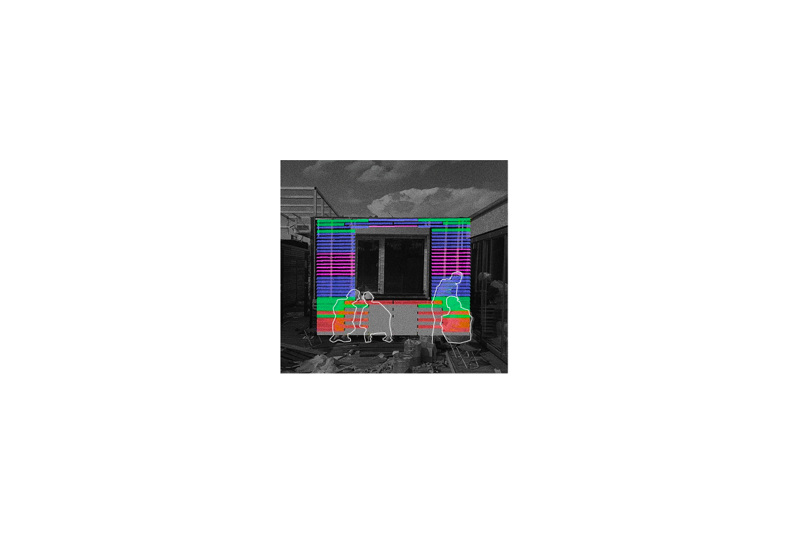

MR technologies provide unskilled implementers with a handy approach to materialize complex designs.
Instead of chasing zero-tolerance implementation and avoiding any potential deviations, MR-aided design practices aim to increase construction allowance by injecting computation into human operations.

This sheds light on the construction activities that still heavily rely on manual labor. Especially for non-standard building practices that are carried out within developing regions, the involvement of holographic instructions makes the entire implementation process more systemic and resilient to meet design expectations. Also, the easy access to hardware devices like HoloLens and smartphones, together with their MR applications such as Fologram, lowers the threshold for adopting this technology in action.

We shared our MR-aided design-build workflow at the CAADRIA 2022 conference. Our project-based research aims to illuminate the reliance on manual labor in construction, particularly for non-standard practices in developing regions.

## Background

AURORA is a passive residential building designed for 2021 Solar Decathlon China, sponsored by the Department of Energy of the United States.It was built in Zhang Jiakou, China (where the Winter Olympics was held this year). AURORA was a joint project carried out by Technical University of Denmark & Soochow University. It aligns with the GOAL 9 of UN Sustainable Development Goals.

## Workflow

We have integrated emerging tech into a construction workflow devised for complex, full-scale projects. AURORA demonstrated the validity and effectiveness of this workflow.

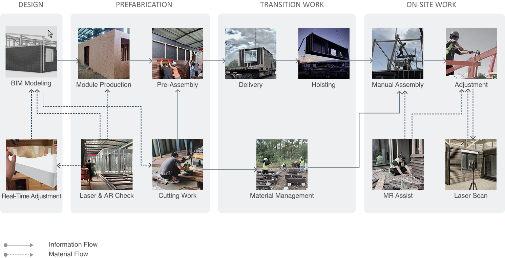

## Design Process
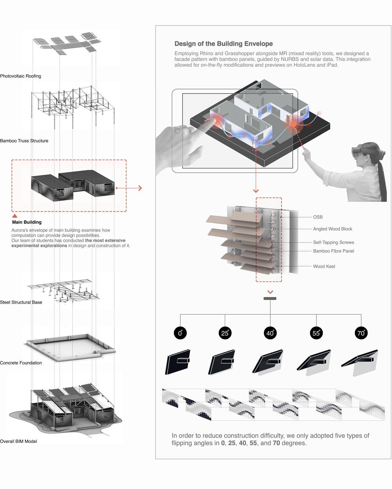

## Pre-holo Process
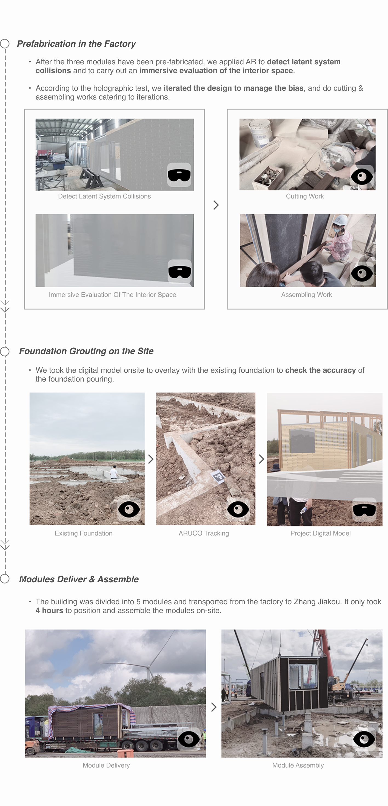

## Holo Process

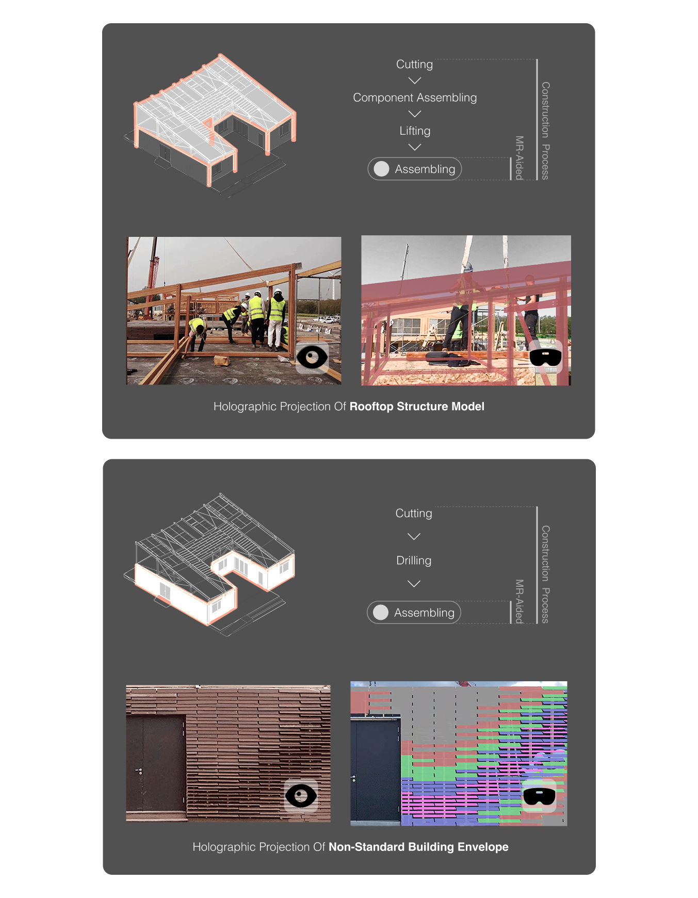

We chose to apply MR-assisted construction in the assembling process of the rooftop structure & the non-standard building envelope which most rely on manual construction for.

Through customizable parameters controlling model mobility, rotation, visibility of layers, and color settings, operators could precisely calibrate the alignment of virtual and actual elements, adapting projection clarity to existing lighting conditions.

 

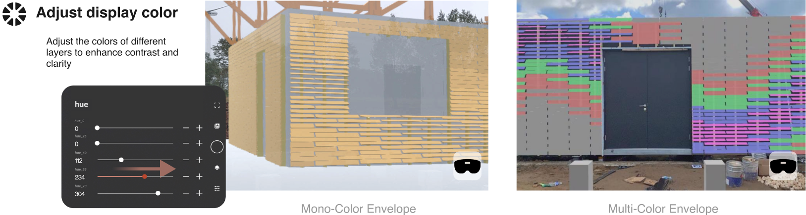
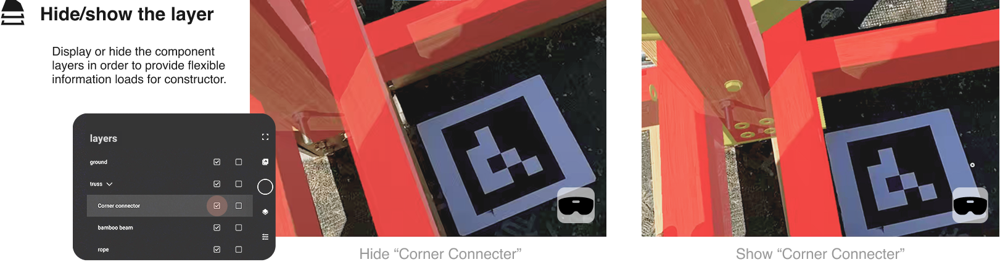
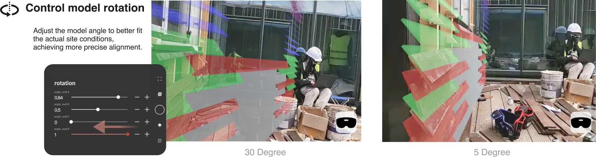

### Collaboration

With 13 students and 2 MR devices at hand, collaborative work between those equipped with the devices and those without became crucial. So, we explored  and test different ways of cooperating to maximize the benefits of MR in construction, including registration and adjustment, synchronized work and cross-time work. We also assessed each ways and applied the most helpful ones in larger scopes.

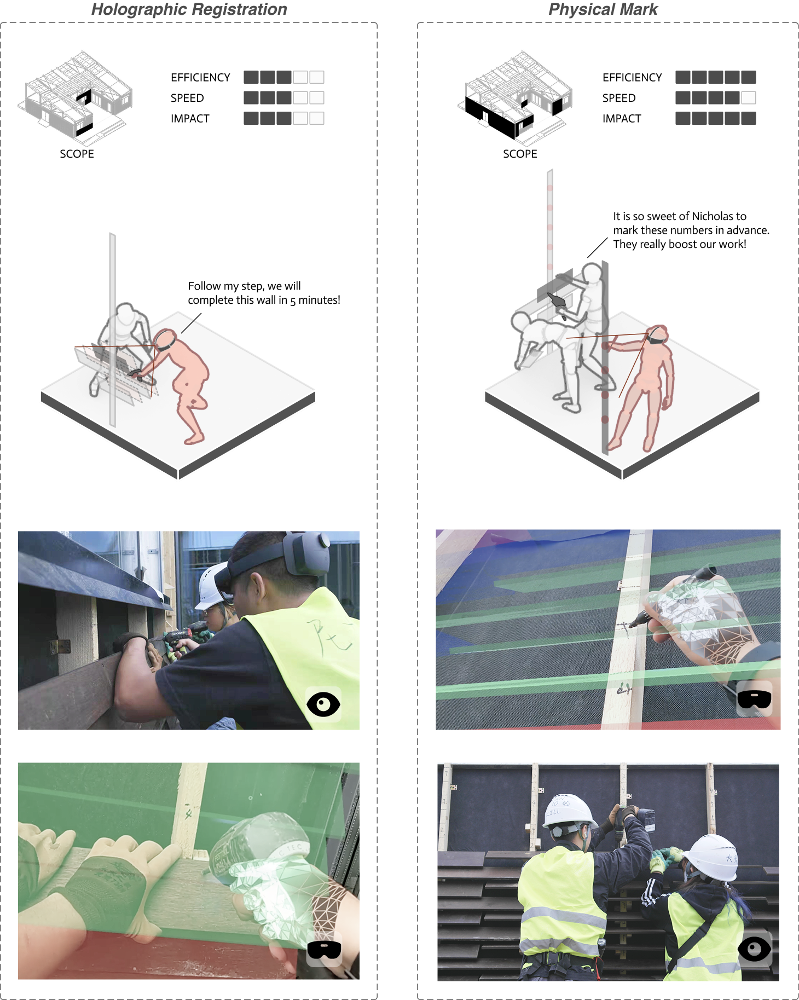
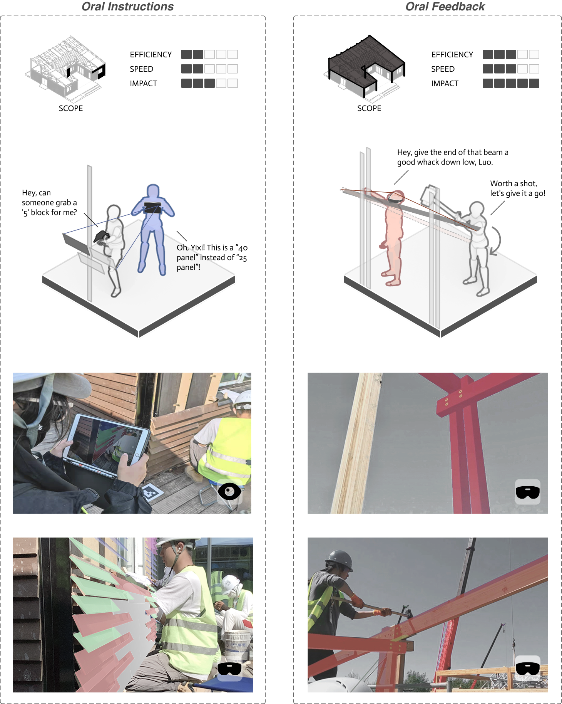

## Evaluation

The scan of the constructed building focused on the non-standard facade using multiple AR-aided methods. By fitting together as-built cloud data with design model, the construction deviations could be calculated.

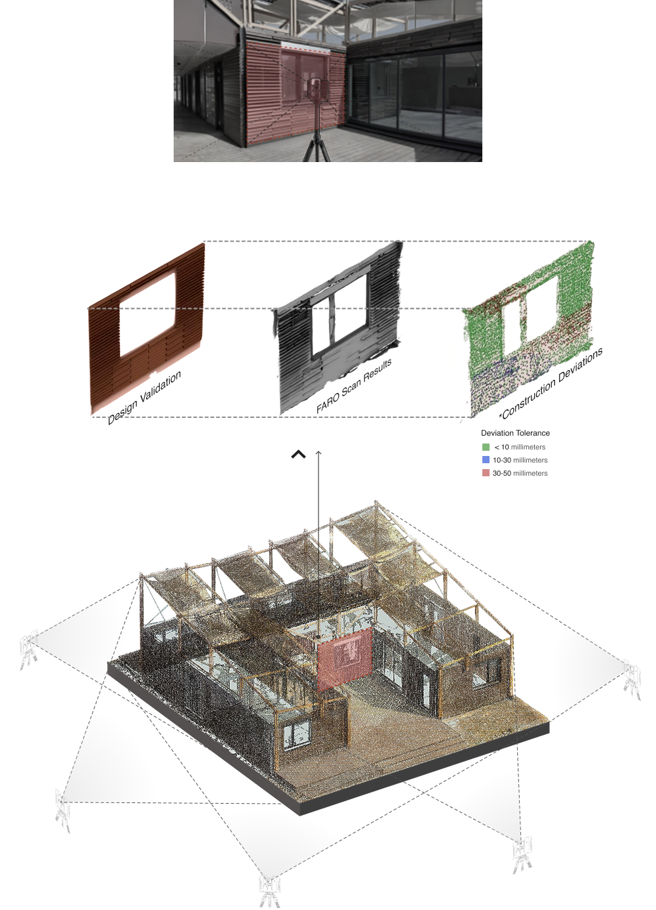

## Team, Aurora, and Snow
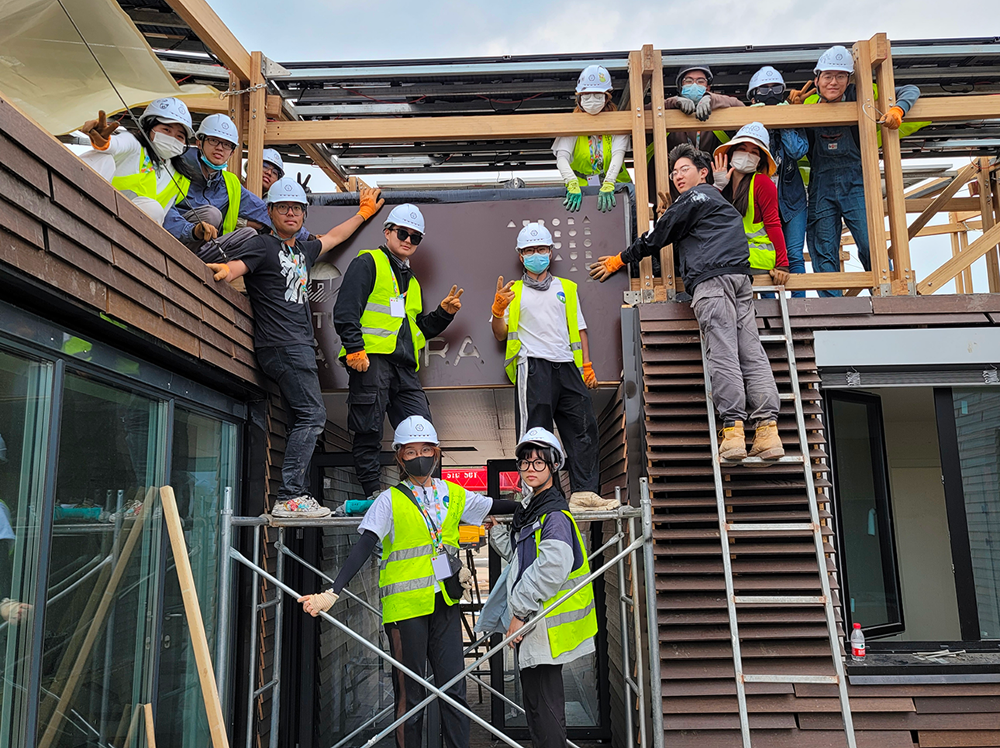
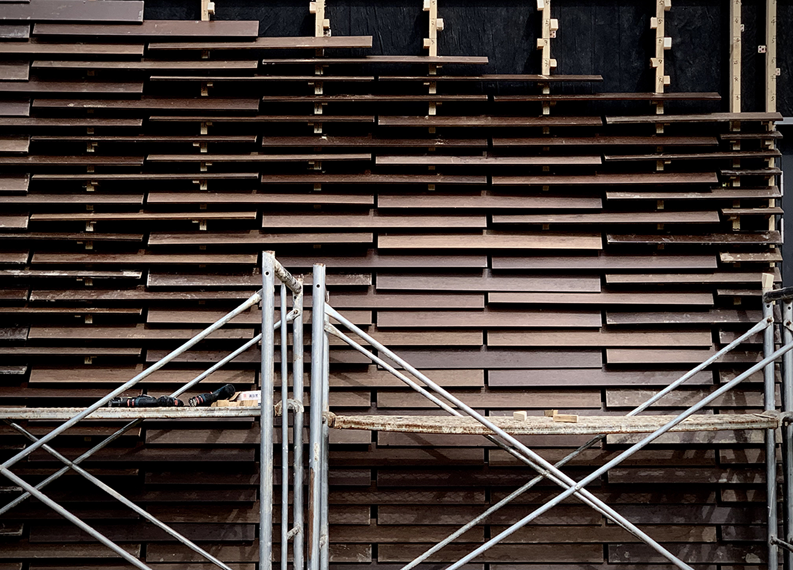

