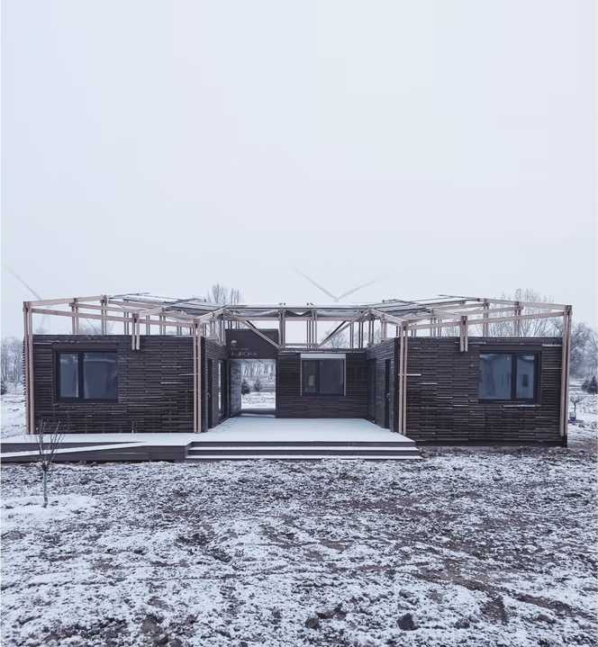

MR technologies provide unskilled implementers with a handy approach to materialize complex designs.
Instead of chasing zero-tolerance implementation and avoiding any potential deviations, MR-aided design practices aim to increase construction allowance by injecting computation into human operations.

This sheds light on the construction activities that still heavily rely on manual labor. Especially for non-standard building practices that are carried out within developing regions, the involvement of holographic instructions makes the entire implementation process more systemic and resilient to meet design expectations. Also, the easy access to hardware devices like HoloLens and smartphones, together with their MR applications such as Fologram, lowers the threshold for adopting this technology in action.

We shared our MR-aided design-build workflow at the CAADRIA 2022 conference. Our project-based research aims to illuminate the reliance on manual labor in construction, particularly for non-standard practices in developing regions.
<figure>
  
  <figcaption>Aurora in Snow</figcaption>
</figure>

