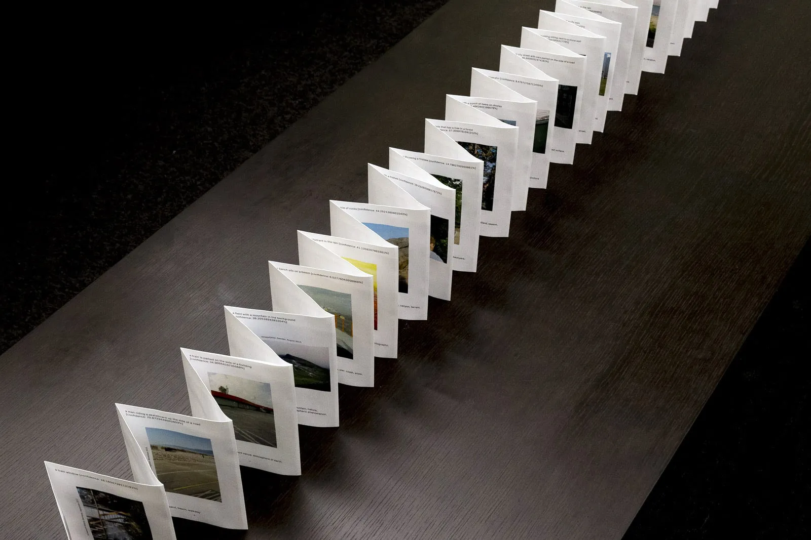
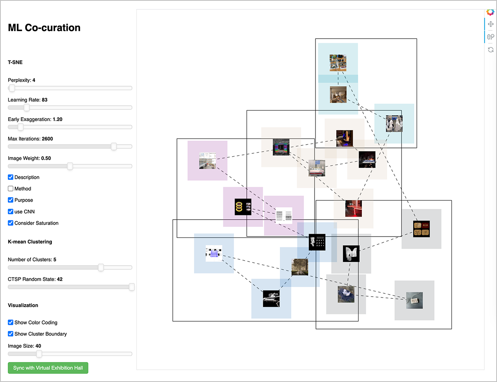
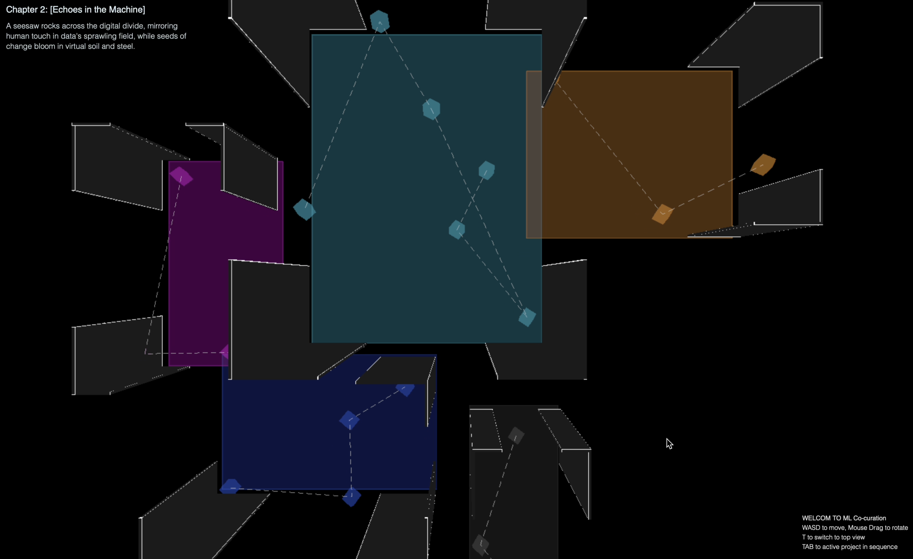
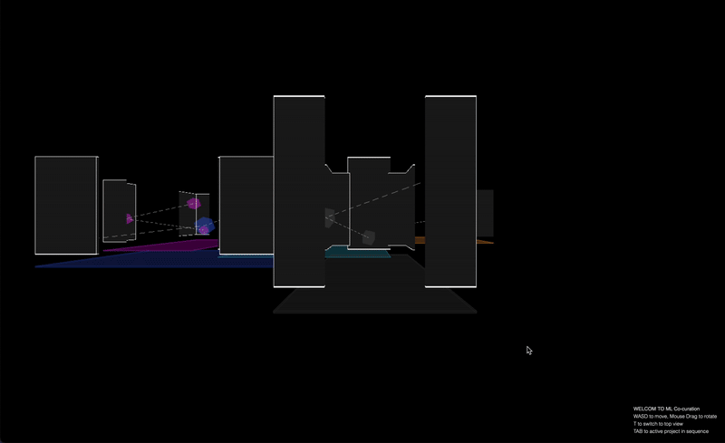

## Background, Questions and vision

[Computed Curation ↗](https://philippschmitt.com/work/computed-curation) created by Philipp Schmitt serves as the precedent for this project. It is essentially automation to produce without a human designer in the loop, where the machine completes all decision-making. This is an interesting speculative design experiment that sparks my two questions regarding this topic:

- Can machines bring creativity in configuration of art works through computing?
- How to integrate a designer's agency into the automation process to enhance the overall quality and satisfaction of the work?

<figure>

<figcaption>Computed Curation, Philipp Schmitt, 2017</figcaption>
</figure>

This project is used as a tool to explore these questions. To do so, I focus on three main areas:

1. Exploring strategies to incorporate the designer as part of the curation process, thereby allowing more space for the designer to make collaborative decisions with the machine.
2. Inviting designers to participate and evaluating their satisfaction with the co-creation results, as well as whether they can identify latent creative surprise among a body of work with the help of machine.
3. Reflecting on both the limitations and the potential strengths of the system.

My vision is that new AI infrastructures can help designers discover latent spaces and opportunities in partnership with their creative agency, rather than merely providing a single predetermined answer.

<figure>

<figcaption>Bokeh interface to tweak parameters</figcaption>
</figure>

<figure>

<figcaption>top view of the exhibition hall</figcaption>
</figure>

<figure>

<figcaption>tour around the virtual exhibition hall</figcaption>
</figure>

## Wait and see

This project is still in progress! I will make a more user-friendly interface, implement the portfolio generation script, and test it with my friend Mai, a photographer based in Milan, Italy.
