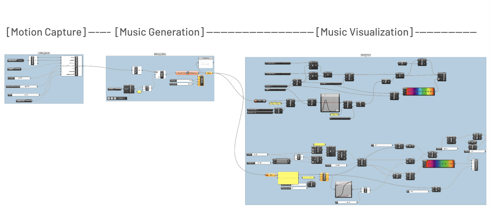

## Concept

Traditional music performance uses bodily gestures, like a pianist's finger movement, to convey musical expression, but these movements are often overlooked in music creation. Modern digital tools simplify music creation but reduce bodily gestures to mechanical actions, failing to capture natural flow and expressiveness. Inspired by dance, where movement and music are interconnected, this project aims to transform body movements into both sound and visual media, making the body central to music creation.

## Pipeline

● Motion Capture: Kinect V2 captures the user’s joint coordinates, which are streamed
into Grasshopper via the Firefly plugin.

● Sound Generation: The Firefly Tone Generator, combined with Python scripting,
generates notes based on the input parameters (joint movements).

● Visual Rendering: Using Grasshopper’s geometric functions, sound frequency, volume,
and other data are mapped to 3D dynamic visual effects, such as rotating or expanding
circles and lines.

## mo-sic

Different body parts (such as hands, head, elbows, and knees) trigger different pitches,
generating notes that correspond to the joint movements. Slow movements trigger a
series of short notes, mimicking the “shaking” sound of stringed instruments; faster
movements trigger a single long note.

Inspired by Lévy's concept of virtualization, we aim to let body movements enter virtual space,
creating a blended reality. The multi-layered feedback of sound and visuals expands the
movements within the virtual environment while giving users a new understanding of bodily
expression.

## Potential Points

The system can expand to a larger scale, by enhancing the output end, making richer translation, or building better feedback loop.