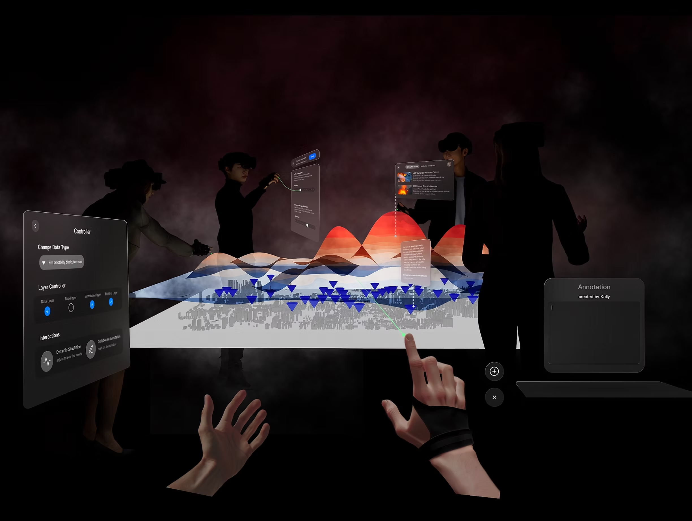

## Context & Research

### Background
During my 2023 Fall internship at an institute, I worked on urban data storytelling. I discovered that current urban data representation methods lack a human-centric focus, making it difficult for individuals with less data literacy to participate in public data discussions. This hampers both inclusive data discussions and humane decision-making.

I did some interview on what are the specific challenges in data comprehension among participants from diverse backgrounds. Here are some of the answers:

**1. Challenge on Engaging in Discussions**  
> "Talking in these discussions is tough for me. The data often feels too complex, leaving me unsure about how to ask questions or share my thoughts."  
> ———— Mr. Hua, 64Y

**2. Challenge on Understanding Data Correlations**  
> "I feel hard relating data to its real-world impact on our lives and safety. The data feels remote."  
> ———— Ms. Lee, 25Y

**3. Challenge on Grasping the Link Between Data and City Life**  
> "Understanding the links between different data sets is challenging. I need something that makes the data's stories clearer."  
> ———— Ms. Tang, 42Y

I also studied various data representation methods(including vocalization, visualization, and annotation) to capture their strengths for potential enhancements to the data representations in public discussions. These methods indicate strong potential to bolster public discourse by making data more accessible, relatable, and comprehensible.

## Ideation

### Core Design Question
How might we improve the understanding and empathy with urban data in public discourse, particularly for non-technical individuals, through creating an immersive experience beyond traditional data visualization?

### Proposed Solutions

➊ Dynamic data simulation

➋ Responsive interaction

➌ Collaborative annotation

## Prototyping

### Data Source
The Probability Density Distribution Map of fire incidents in Fengdong City, Shanxi, China, from 2017-2019, was chosen as the data source for this exploratory design.

## Testing

### Test Process Overview
After quickly designing and developing a low-fidelity prototype with Unity MRTK2 and Arduino, I conducted a proof-of-concept test of the entire workflow. This substantiated **Responsive Interaction** as the most impactful part, leading me to focus on further testing and refinement.

Testing Rounds：
- **Round 1** - Initial prototype evaluation

- **Round 2** - Refinements based on user feedback

