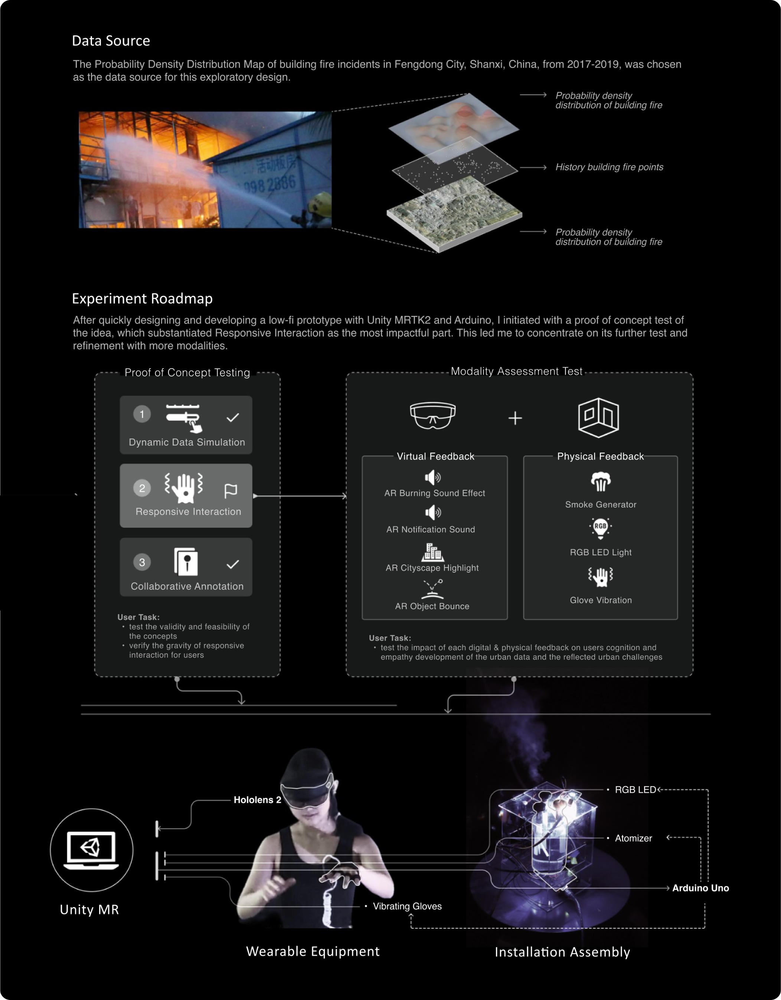
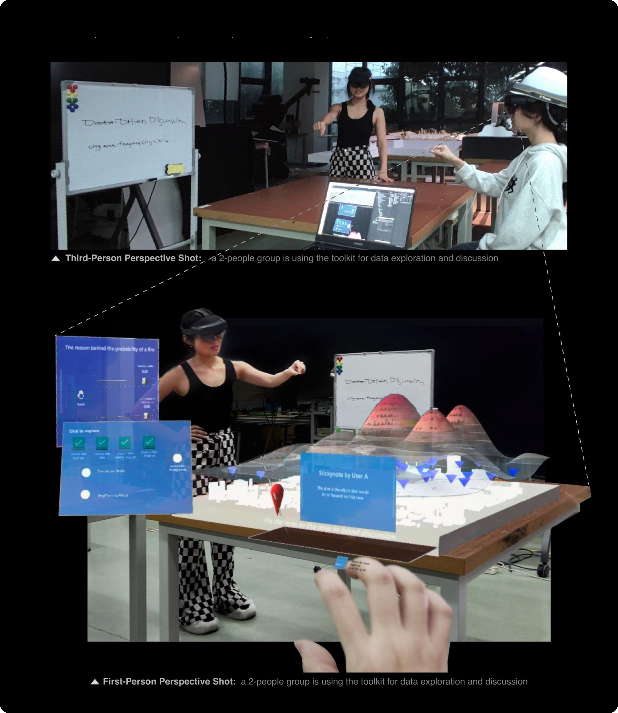
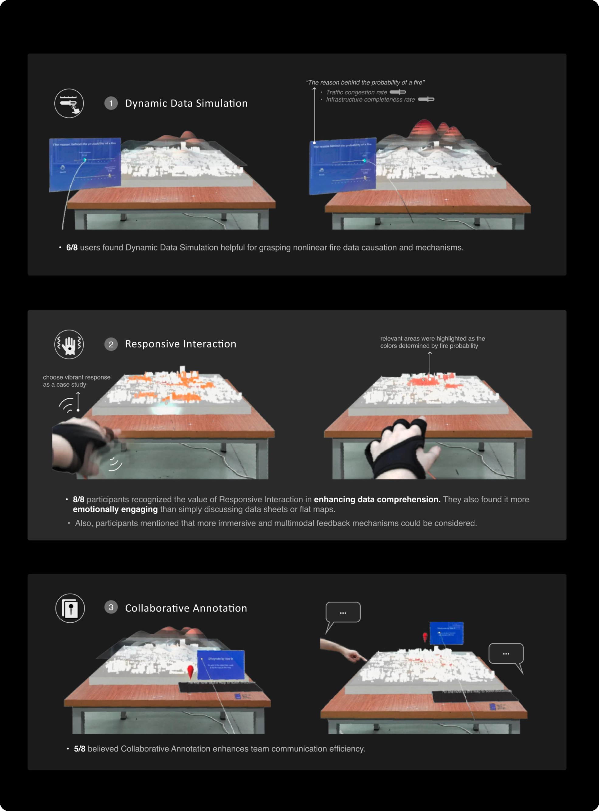
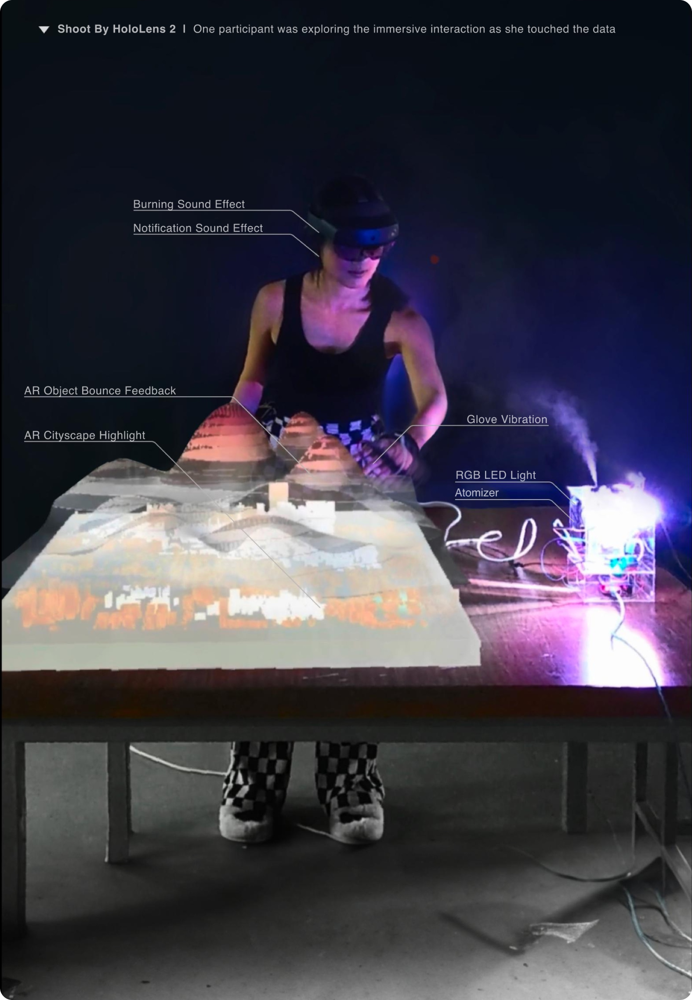
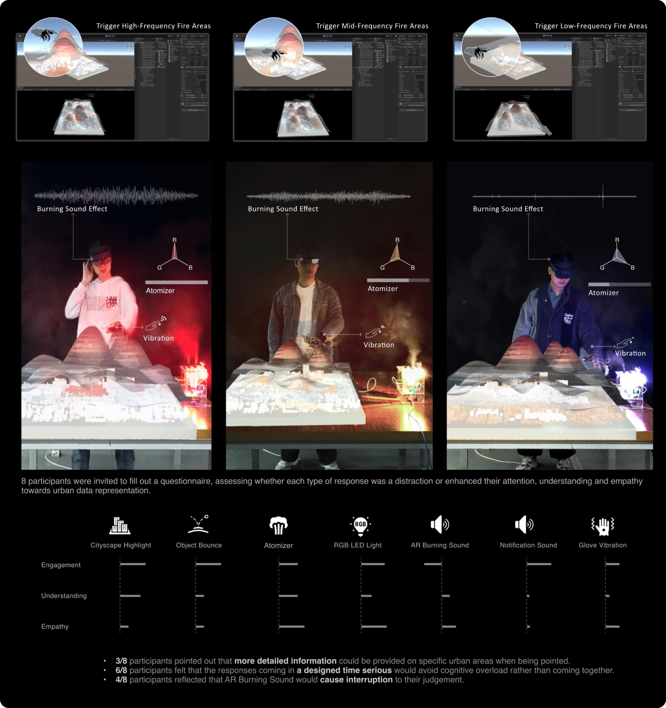
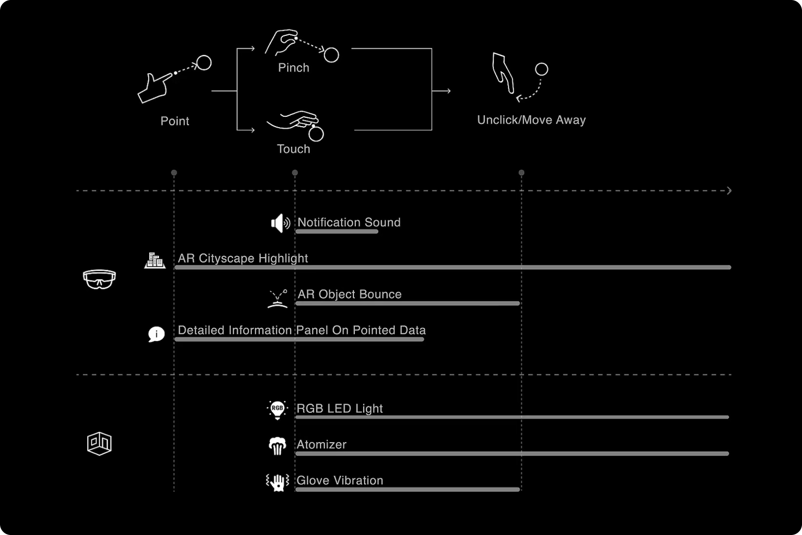

## Context & Research
During my 2023 Fall internship at an institute, I worked on urban data storytelling. I discovered that current urban data representation methods lack a human-centric focus, making it difficult for individuals with less data literacy to participate in public data discussions. This hampers both inclusive data discussions and humane decision-making.

### Interview
I conducted interviews to identify key challenges in data comprehension among individuals from diverse backgrounds. The responses highlighted three main areas of difficulty:  

**1. Barriers to Participating in Data Discussions**  
The complexity of data can create uncertainty about how to engage in discussions, making it difficult for individuals to formulate questions or contribute their perspectives. This suggests a need for more intuitive ways to navigate and interpret data in collaborative settings.  

**2. Difficulty in Recognizing Real-World Implications**  
Many participants found it challenging to connect data with its tangible impact, particularly in areas like safety and daily life. When data appears abstract or detached from lived experiences, it becomes harder to contextualize its relevance and inform decision-making.  

**3. Challenges in Understanding Data Relationships**  
Interpreting the connections between different datasets emerged as a significant hurdle. Without clear frameworks or visual representations, identifying patterns and drawing meaningful insights remains difficult. This points to the importance of making data narratives more accessible and interpretable.

I also studied various data representation methods(including vocalization, visualization, and annotation) to capture their strengths for potential enhancements to the data representations in public discussions. These methods indicate strong potential to bolster public discourse by making data more accessible, relatable, and comprehensible.

## Ideation

### Core Design Question
How might we improve the understanding and empathy with urban data in public discourse, particularly for non-technical individuals, through creating an immersive experience beyond traditional data visualization?

### Proposed Solutions

➊ Dynamic data simulation

➋ Responsive interaction

➌ Collaborative annotation

## Prototyping
The Probability Density Distribution Map of fire incidents in Fengdong City, Shanxi, China, from 2017-2019, was chosen as the data source for this exploratory design.

After quickly designing and developing a low-fi prototype with Unity MRTK2 and Arduino, I initiated with a proof of concept test of the idea, which substantiated Responsive Interaction as the most impactful part. This led me to concentrate on its further test and refinement with more modalities.

## Testing

### Test Process Overview
After quickly designing and developing a low-fidelity prototype with Unity MRTK2 and Arduino, I conducted a proof-of-concept test of the entire workflow. This substantiated **Responsive Interaction** as the most impactful part, leading me to focus on further testing and refinement.

 
 
 
- TEST ROUND 1| Proof of Concept

Initially, 8 users were introduced to HoloLens basics before user testing. They then paired up for data exploration and discussion, evaluating concept efficacy and general user experience quality within 3 main features.
The AR city model was scaled (700*980 mm) for focused small group discussions.

Takeaways
The test substantiated the design hypothesis that Responsive Interaction is a key feature, meriting further exploration to uncover more immersive and multimodal feedback mechanisms. Responsive Interaction was the most
impacttul part of the sustem to delve into.

 
 
 
- TEST ROUND 2| Modality Assessment Test

It had been confirmed that Responsive Interaction significantly enhances visualization in user experience in the test before. So I conducted Modality Assessment Test to evaluate how each digital & physical responses affect user cognition and empathy towards data representation. This was aimed at identifying the most effective combination of responses for an optimal user experience.

## Design Result
### Interaction Sequence

### Scenario
<figure>
  
</figure>