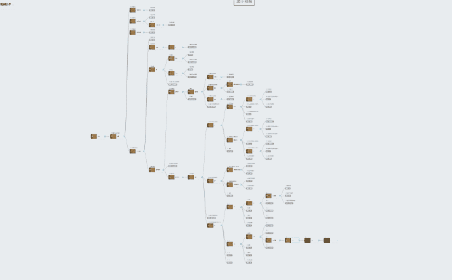

## Story tree

## Preview

*Immersive Narrative Puzzle Game: Where Lateral Thinking Meets Environmental Storytelling*  

### **Project Overview**
  
A text-based adventure game blending [lateral thinking puzzles](https://www.reddit.com/r/lateralthinking/) (a novel text riddles) with environmental exploration. Players uncover fragmented clues indoors (symbolic objects, diaries) while interacting with outdoor NPCs to solve a meta-mystery: weaving the traumatic history through the lens of a woman grappling with fragmented memories in the first-person perspective.  

### **Core Mechanics**  

Dual-layered **"Space & Psyche" interaction system**:  

- **Environmental Semiotics**: Procreate-drawn clues (withered roses --> lost families, locked storage room --> buried guilt)  

- **Branching NPC Dialogues**: Dynamic choices that lead to different story branches

- **Truth-Locking Mechanism**: Final "Sea Turtle Soup" riddle requires synthesizing indoor evidence + outdoor testimonies (e.g., a vagrant with a rose pin suspected to be the disowned youngest son)  

### **Player Reviews Highlight**  

> *"Roses trace timelines... The locked storage room mirrors Rose's mind. When NPCs fled yet the vagrant stayed, I realized I am Rose — a mother rewriting her son's betrayal as mental delusions. The final rose isn’t just a clue; it’s the suture holding her shattered reality."*  

> *"This is incredible! Every 'Sea Turtle Soup' puzzle feels fresh, and the endings linger in your mind like poetry... though sometimes it feels like solving a haunting literature essay. Seriously amazing—can’t wait for more!"*

> *"The video integration adds so much immersion compared to text-only versions! The visuals help contextualize clues without spoon-feeding answers. My take: 'I' AM Rose, and the 'stranger' is her youngest son. This isn’t just time travel—it’s a ghostly reckoning where he confronts his wartime betrayal before embracing death again. The war tragedy WRECKED me."*

> *"The emotional subtlety here aches. Solving puzzles left me with this unresolved sorrow… like love letters drowned in gunpowder. Rose’s pain isn’t spelled out, but the contrast between her hopeful diaries and the bleak truth? Devastating [sob emoji]."*

> *"Refreshing take on lateral thinking puzzles! Less horror, more historical melancholy. The music elevates the bittersweet tension—easily the most emotionally resonant 'Sea Turtle Soup' I’ve ever played."*

### **Innovative Features**  

**Trauma as Gameplay Grammar**:  

- **Triple-Encoded Objects**: Clues function as evidence (literal), metaphors (psychological), and historical relics (e.g., recruitment posters eroded by time/guilt) 

- **Unreliable Narration**: Players initially investigate "another family" before confronting their **own identity** as Rose  
- **Ambiguous Endings**: Choices dissect ethical dilemmas (Was the son a traitor? A protector? Or a figment of Rose’s broken psyche?)  

### **Release**  
Live on **[Bilibili]**  |  (need registration)
