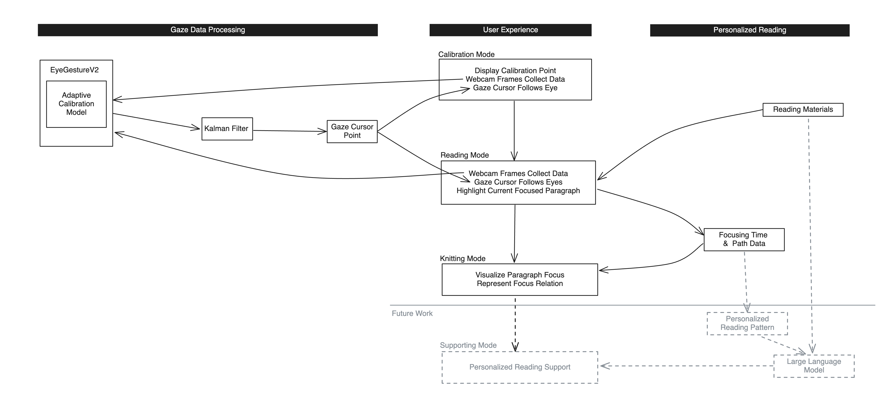

This project explores the complexities and entanglements of the non-streamlined reading process through an interactive web-based format. Drawing an analogy between human attention and knitting, with the text representing the yarn, it highlights the intertwined and sometimes messy nature of reading. The webpage provides a split-screen interface for reading two chapters, allowing users to navigate freely. Machine learning is integrated to predict the user's eye position on the screen.

<figure>
  
  <figcaption>Figure 1: Calibration mode.</figcaption>
</figure>

<figure>
  
  <figcaption>Figure 2: Reading mode.</figcaption>
</figure>

<figure>
  
  <figcaption>Figure 3: Knitting mode.</figcaption>
</figure>

Inspired by the discussion in the Hybrid Body as well as Technological Imaginations of Design in Inquiry to Computational Design course 24Fall, this project aims to reveal the interplay between humans, technology, and text in the reading process by capturing human gaze in reading and reveal the twist reading process. Since the course modules are cross-relating, I also take World-Making as a lens.
