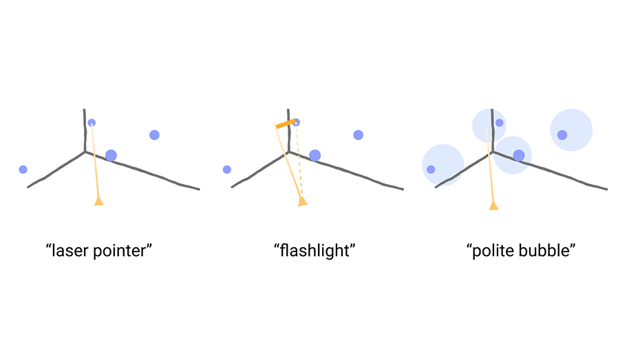
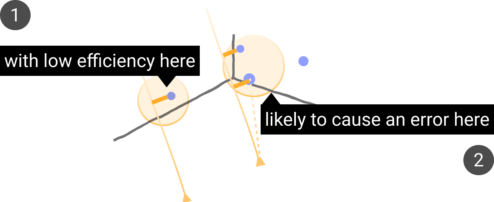
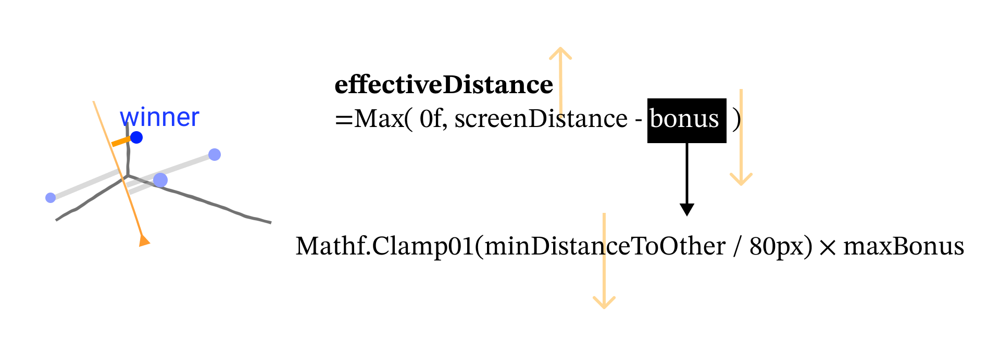

## Selection

### Brainstorming

<figure>
  
  <figcaption>metaphors for selection interaction</figcaption>
</figure>

### Prototype 2: Adaptive Flashlight for Ray Selection

<figure>
  
</figure>

##### Painpoints
<figure>
  
  <figcaption>Selection painpoints: low efficiency in sparse regions; high error risk in dense regions.</figcaption>
</figure>

1. **Low efficiency** in sparse regions → fixed flashlight cone requires precise aiming.  
2. **High error risk** in dense regions → cone easily covers multiple targets.

##### Solution

Adaptive flashlight adjusts tolerance dynamically:  
- Sparse regions → widen tolerance (larger cone, easier selection).  
- Dense regions → narrow tolerance (smaller cone, fewer mis-hits).

<figure>
  
  <figcaption>Effective distance formulation with density-based bonus.</figcaption>
</figure>

**Winner selection:**

$$
\text{winner} = \arg\min_{i}\; d_{\text{eff}}^{(i)}, 
\quad \text{s.t. } d_{\text{eff}}^{(i)} < \tau
$$

where:  
- $d_{\text{eff}}^{(i)}$ is the effective distance for candidate $i$  
- $\tau$ is the acceptance threshold in pixels

### Prototype 3: the Polite Bubble

<figure>
  
  <figcaption>Prototype 3: the Bubble</figcaption>
</figure>

Principles: 

- Bubbles should wrap the objects.
- Bubbles should not be too large.
- There is an upper limit for overlapping.

#### Objective

$$
J(b_i, s) = w_r \cdot r_{px}(b_i, s) - w_p \cdot P(b_i, s)
$$

where:  
- $r_{px}(b_i, s)$ is the screen-space radius of bubble $b_i$  
- $P(b_i, s)$ is the overlap penalty  
- $w_r, w_p$ are trade-off weights  

#### Overlap Penalty

$$
P(b_i, s) = \sum_{j \in N(i)} 
\left[
\frac{\max \bigl(0,\; (r_i + r_j + s_m) - d_{ij}\bigr)}{r_i + r_j + s_m}
\right]^{\alpha}
$$

where:  
- $N(i)$ is the neighbor set of bubble $i$  
- $r_i, r_j$ are bubble radii  
- $d_{ij}$ is the center distance between $i$ and $j$  
- $s_m$ is a margin parameter  
- $\alpha$ controls penalty growth  

#### Solver

The optimization iterates through three steps (≈20 passes):  
1. **Enlarge with penalty** – grow bubbles while respecting $P(b_i, s)$.  
2. **Side movement** – push strongly when overlapping, softly when close.  
3. **Re-enlarge** – expand again after separation.  

#### Bubble Initialization

$$
P_{target}(b_i) = g \cdot \bigl[w_x \cdot P_{dist}(b_i) + w_y \cdot P_{size}(b_i) + w_z \cdot P_{iso}(b_i)\bigr]
$$

where:  
- $P_{dist}(b_i)$ is depth-based scaling (farther objects get larger)  
- $P_{size}(b_i)$ is size compensation for small objects  
- $P_{iso}(b_i)$ is isolation-based enhancement for isolated objects  
- $w_x, w_y, w_z$ are weights, $g$ is a global scale factor  

In this way, smaller objects, far-away object will be compensated with larger initial size since they are hard to select. Also, the isolated object will be assigned with larger initial size for quick and rough selection.

## Manipulation

[wait and see ...]

## UI Optimization

[...]