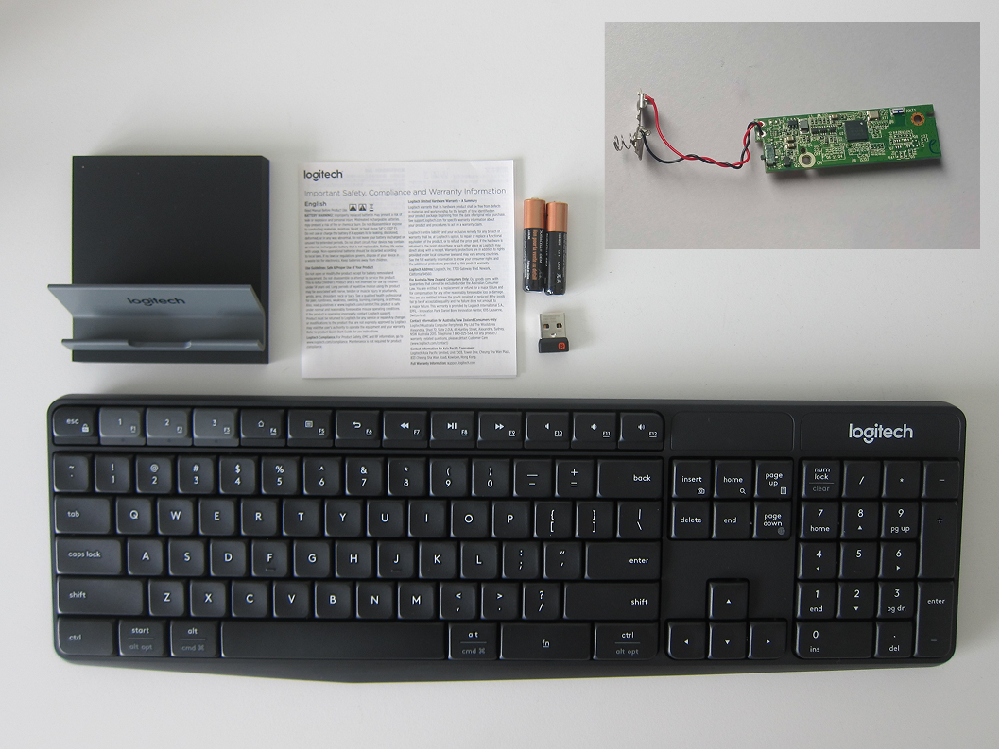
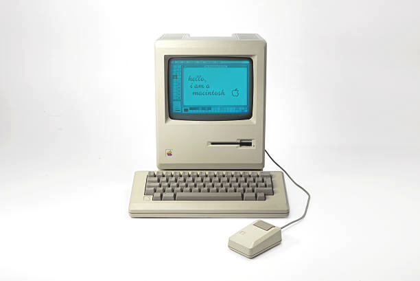
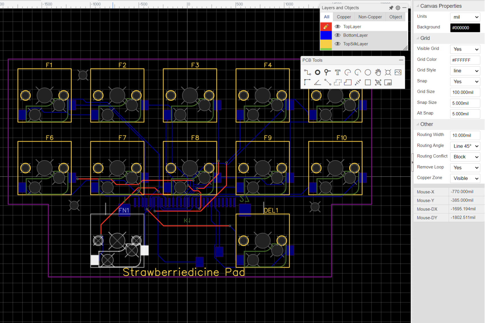
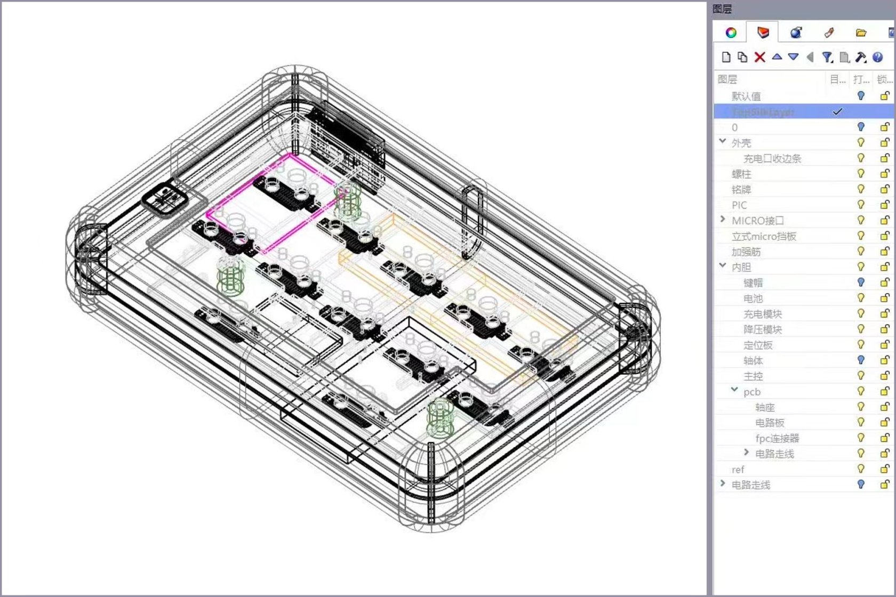
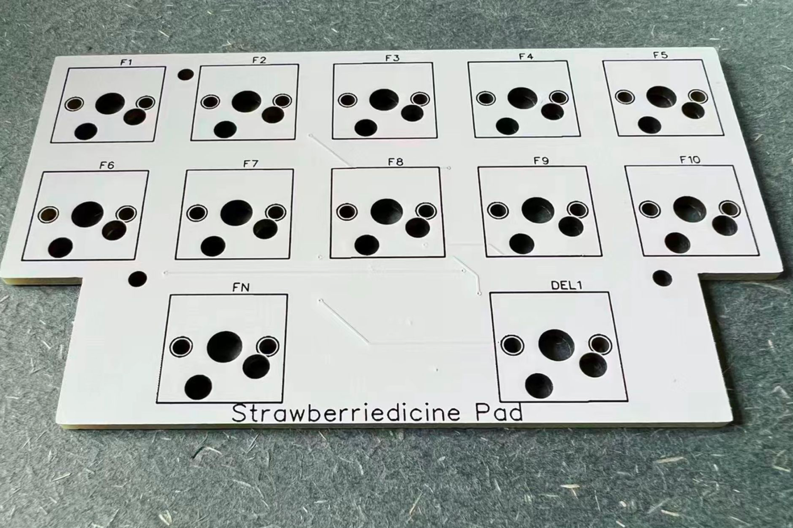
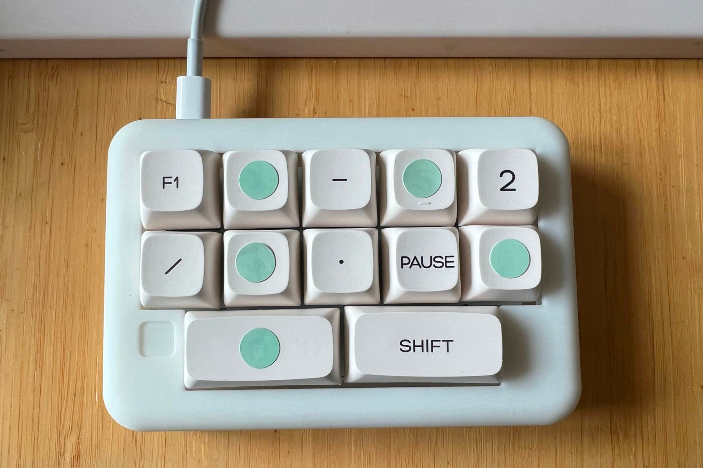

I designed a custom keypad based on a Logitech keyboard controller to suit my personal usage preferences, assisting me in daily computer tasks such as editing, modeling, and drawing. The advantage of the K375s controller chip is its compatibility with multiple operating systems, support for both wireless Unifying and Bluetooth connections, and the ability to connect to a phone at any time.

<figure>

<figcaption>the Logitech K375s and itscontroller chip</figcaption>
</figure>

The design loosely pays tribute to Apple's Macintosh keyboard.

<figure>

<figcaption>the old fashioned Apple's Macintosh keyboard</figcaption>
</figure>

 
 

