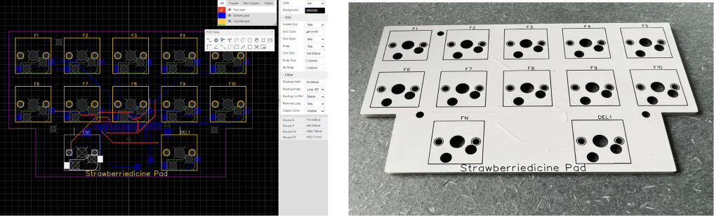
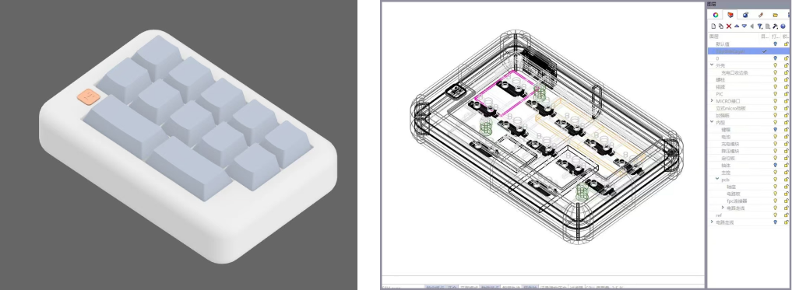

I designed a custom keypad based on a Logitech keyboard controller to suit my personal usage preferences, assisting me in daily computer tasks such as editing, modeling, and drawing. The advantage of the K375s controller chip is its compatibility with multiple operating systems, support for both wireless Unifying and Bluetooth connections, and the ability to connect to a phone at any time.

<figure>

<figcaption>the Logitech K375s and itscontroller chip</figcaption>
</figure>

<figure>

<figcaption>key matrix diagram for the Logitech K375s keyboard</figcaption>
</figure>

Each key is a little switch. I arranged the layout and connect them to a 12 pin socket which is connected to the controller chip.

The design loosely pays tribute to Apple's Macintosh keyboard.

<figure>

<figcaption>the old fashioned Apple's Macintosh keyboard</figcaption>
</figure>

After modeling, I received my printed circuit board and wired components together to test if it works.

After another a few days, I received the 3D printed case. The final assembly looks like this: (I think it super lovely!)

