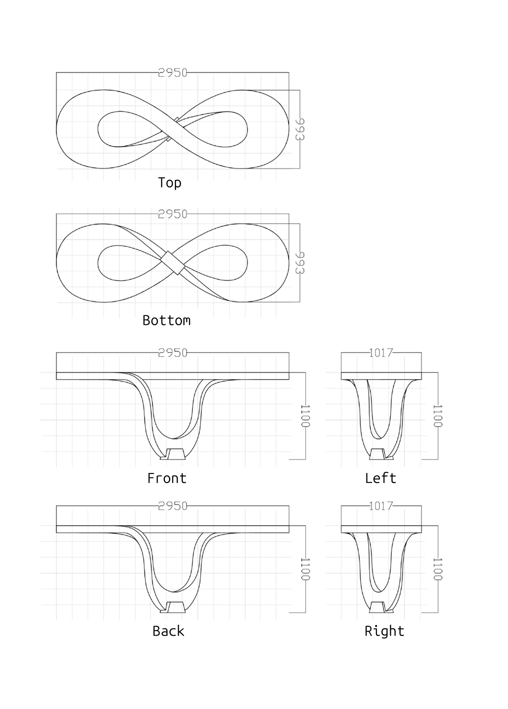
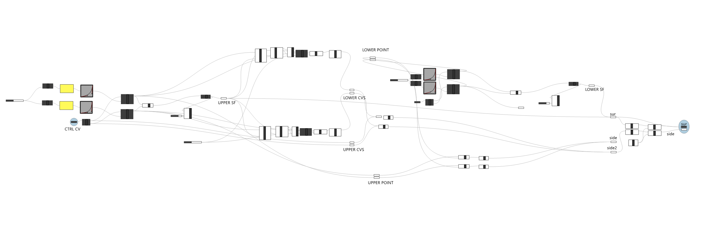
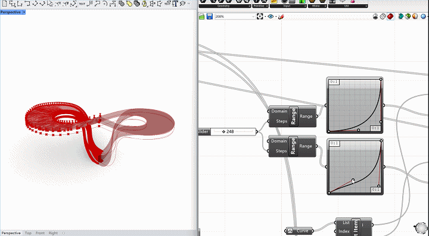
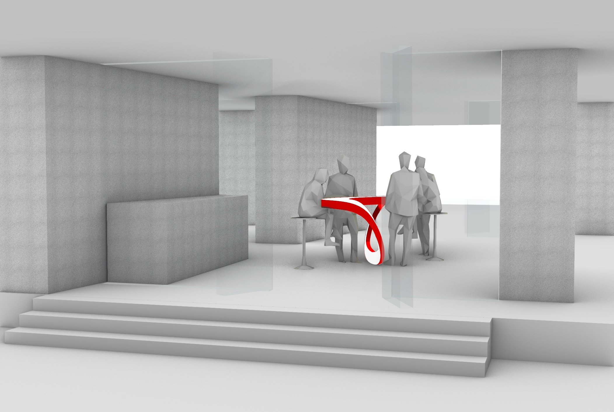
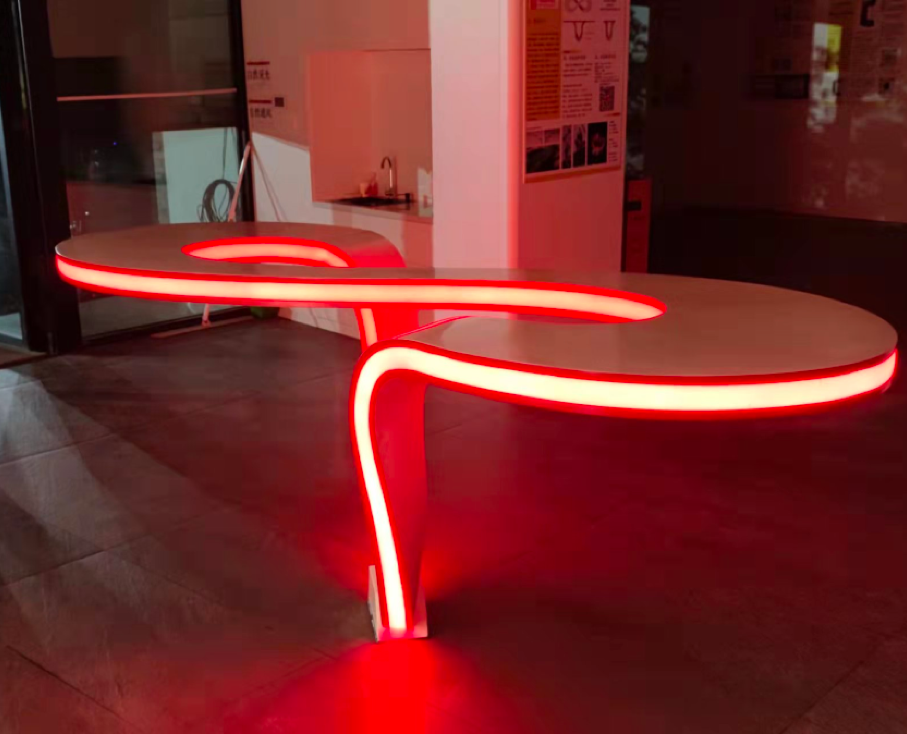
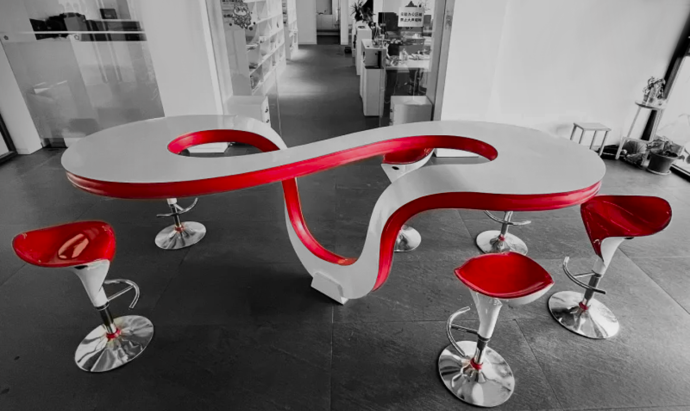

<!--  -->

<figure>
  
  <figcaption>Grasshopper model</figcaption>
</figure>

<figure>
  
  <figcaption>Grasshopper-rhino dynamic tweek</figcaption>
</figure>

<figure>
  
  <figcaption>Holographic projection to see the spacial effect</figcaption>
</figure>

## Structural Estimation

- **Basic Data**
  - **Self Weight**: 186.20 kg  
  - **Bar Counter Surface Area**: 5.87 m²  
  - **Panel Thickness (Steel)**: 2 mm  
  - **Density of Steel**: 7.93 g/cm³  
  - **Skeleton (Frame) Steel Thickness**: 5 mm  

- **Self Weight** (Steel Panels)  
  - **Formula**:  
    $$
    m = A \times t \times \rho \times n
    $$  
  - **Result**: 186.20 kg  

- **Openings**  
  - **Slot Opening Area**:  
    $$
    A = H \times L
    $$  
  - **Result**: 0.56 m²  
  - **Anchor Bolt Area**:  
    $$
    A = H \times L
    $$  
  - **Result**: 0.175 m²  

- **Concrete Base**  
  - **Formula**:  
    $$
    m = V \times \rho, \quad V = l \times w \times h
    $$  
  - **Result**: 420 kg  

- **Load Capacity Estimation**  
  - **Base Support Force (excluding tabletop)**:  
    - **Formula**:  
        $$
        \text{Load Capacity} = \frac{F_{\text{base}}}{F_{\text{person}}} \times 100
        $$  
    - **Result**: 280 kg  

## Deviation Evaluation

We analyzed the deviation after construction through point cloud analysis.

## Showcase

