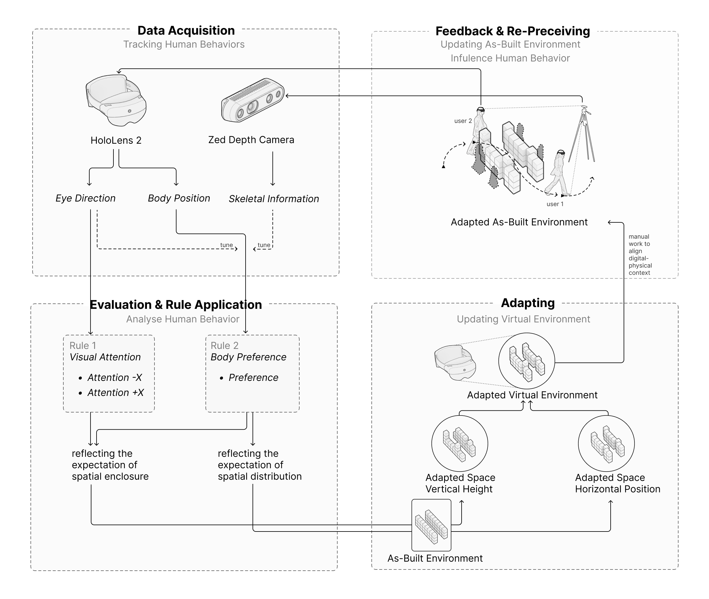
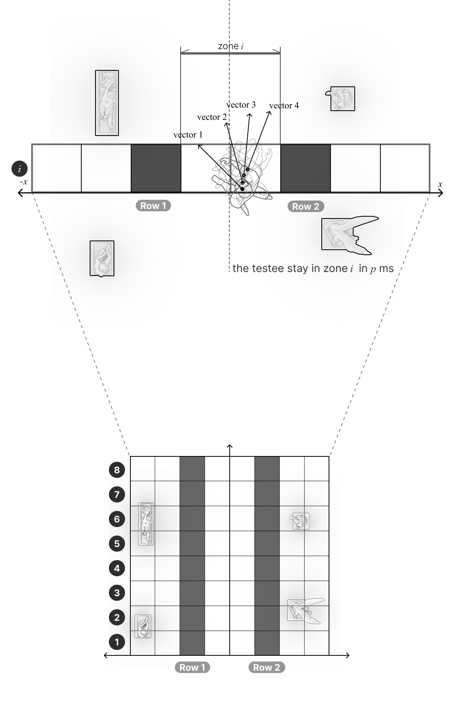
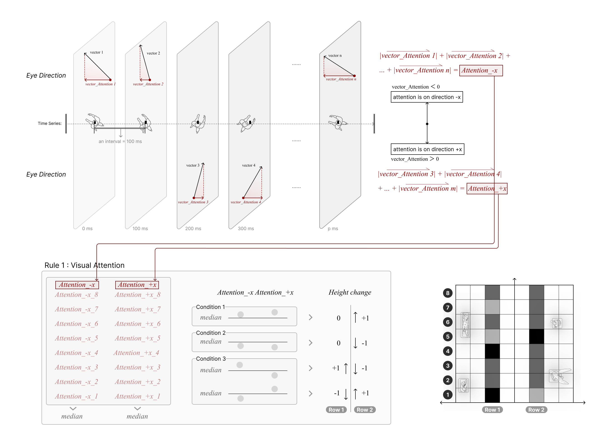
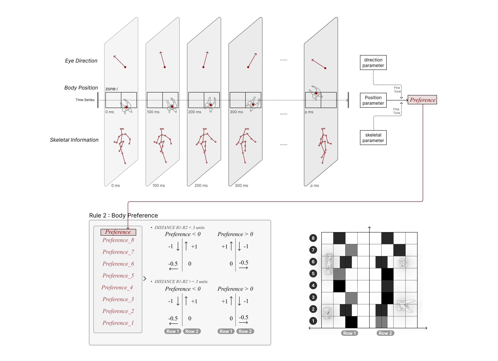

## Cybernetic System
Guided by cybernetic theory, first proposed by Norbert Wiener in 1948, our team re-evaluated the relationship between the body and space, focusing on body preference and gaze direction in exhibition environments. 

<figure>
  
  <figcaption>Figure 1: The constant mutual influence, change, and adaptation of people and the built environment lead to co-evolution for both parties.</figcaption>
</figure>

We developed an interactive demo and conducted a behavioral experiment using MR headsets (HoloLens 2) and AI Stereo Cameras (ZED 2) to gather human factors data in the environment. Through Unity-Grasshopper communication, environment changes are computed, digitalized, and manually physicalized, finally embracing back to the human body. In this feedback loop, the constant mutual influence, change, and adaptation of people and the environment leads to co-evolution for both parties.

### Initial Setup

<figure>
  
  <figcaption>Figure 2: Initial setup of the experiment.</figcaption>
</figure>

### Iteration in Z-Axis: Quantifying Visual Attention

**Vector Definitions:**
- **vector_Attention 1**: Projection of the unit vector of the line of sight in the x-axis direction.
- **vector 1**: The unit vector of the line of sight.

<figure>
  
  <figcaption>Figure 3: Diagram illustrating the quantification of visual attention.</figcaption>
</figure>

### Iteration in XY-Plane: Quantifying Body Preference

<figure>
  
  <figcaption>Figure 4: Diagram illustrating the quantification of body preference.</figcaption>
</figure>

## Experiment Process

<figure>
  
  <figcaption>Figure 5: Zhong Court, Tongji University. Shot by Ziru.</figcaption>
</figure>

Eight testees sequentially viewed four exhibits through the installation, making a round trip within the space. This process involved experiencing two spatial changes. The final shape of the space incorporated the combined attention and body preference information of all participants, reflecting their collective exhibition experience.

<figure>
  
  <figcaption>Figure 6: Data visualization from the experiment.</figcaption>
</figure>

<figure>
  
  <figcaption>Figure 7: Experiment in progress, showing participants interacting with the system.</figcaption>
</figure>

## Award

We brought the interactive system to a real exhibition setting at **DigitalFUTURES 2024, Shanghai**.

Our work has been accepted by **The 16th International Conference on Environment-Behavior Studies**, Committee of Environment-Behavior of Architectural Society of China (**CEB-ASC 2024**), hosted from **November 8-10, 2024**.

Additionally, we won the **Best Academic Contribution Award** at **The 9th Cross-Strait Youth Maker Competition, 2024**.

<figure>
  
  <figcaption>Figure 8: The interactive system showcased at DigitalFUTURES 2024 in Shanghai.</figcaption>
</figure>
