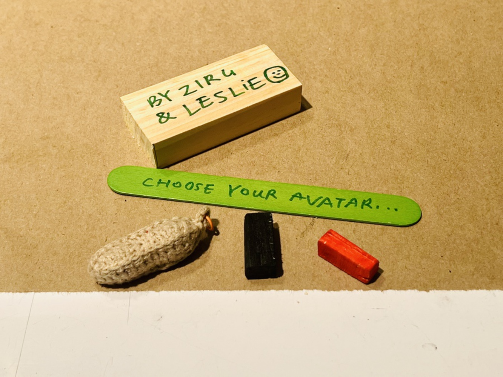

## Background
We plan to try a new framework for paired devices, mimicking the motion of two objects under physical laws to make events on the other end more evident. 

Everyone has an intuitive understanding of gravity: for example, when using a scale, we can easily understand why one side sinks and the other rises; or when pulling a blinds cord, the cord descends while the blinds rise. These movements indicate that a force is at work within the physical mechanical system, which we can use to reflect the presence of the other device in our paired device system.

We started by learning from historical cases of remote gestures/motions, from **SHAKER**, which translates movement into shakes, to more paired devices in the [Yo-Yo Machine project gallery↗](https://www.yoyomachines.io/). Then, we moved on to making our own paired device, putting our ideas into practice.

## "SHAKER"

Our precedent was Rob Strong and William Gaver's **Shaker** from their 1996 paper, *Feather, Scent and Shaker: Supporting Simple Intimacy*. Developed at RCA's Computer Related Design department, this IoT device aims to facilitate **nonverbal, emotional communication** between separated lovers or even less intimate friendships.

By shifting the context of peripheral and expressive awareness devices from the professional and public realm to the domestic and personal one, these standalone devices allow for more **ambiguous, impressionistic, and emotive communication**.

## Re-Making

The original **Shaker** setup includes a sender and receiver device for each person. When Person A shakes their (sender) device, mechanical movement of a metal rod inside induces an electric current in the coil, sending an electrical signal to Person B’s receiver device. This activates B’s solenoid, causing **proportional movement** to match A’s gesture.

### Approach
In our remake, we retained the **ball tilt sensor**, focusing on ensuring that the shake/original input would be reliably registered.

Bill of Materials:
- **Particle Photon 2** (microcontroller)
- **INA219** (current monitoring)
- **L298n H-Bridge** (motor driving)
- **Microservo** (for motion response)

Key Adjustments:
- Instead of a solenoid, we opted for a **microservo** to maintain a minimalist setup.
- Considered a **three-axis accelerometer** but chose a **ball tilt sensor** for simplicity and availability.
- The **Photon 2** shares data via the **Particle cloud**, controlling the microservo upon shake detection.

### Takeaways
From this remake, we explored how contemporary **flows of information** have shifted **social norms and dynamics** around ambient, networked communication. We discussed a **common interest in expressing mixed/ambiguous feelings** through signals of varying clarity.

## Re-Interpreting

### Brainstorming
A seesaw is a **lever**; when one side is heavier, it sinks while the opposite side rises. If the weights are equal, both ends remain level.

- **What if two people are not in the same location?**
- **Can they still play on a seesaw together?**
- **How can they interact with a seesaw to feel each other's presence?**

### Strategy
We use:
- **Distance sensors** to detect presence
- **Particle platform** to transmit data
- **Linear actuators** to adjust movement on both sides

This means the movement is no longer **driven by gravity**, but two remote users can still interact with it.

### Process

The process included:
1. **Learning from precedents** (Shakers, Yo-Yo Machines)
2. **Brainstorming ideas** (Seesaw vs. Carrot concept)
3. **Developing the prototype** (Coding, electronics, mechanical design)
4. **Final integration and testing**

Based on the legend that **all carrot roots on Earth are connected**, pulling one carrot **slightly moves another**.

Remote Seesaw Concept：

This concept **evokes childhood memories** of playing on seesaws. The up-and-down interaction remains engaging, even remotely.

Ultimately, we chose the **seesaw concept** for its **feasibility, fun, and intuitiveness**.

## Prototyping

_thumb.jpeg)

This is Leslie's Hands: Thanks to her for designing and assembling such a lovely mechanical design in our project!
 
 
 
We have open-sourced everything about our project on GitHub (except our Particle tokens). We also use this repo for documenting our technical trials. Feel free to visit!

[SEEINGSAW GitHub Repository](https://github.com/zuriniw/SEEINGSAW/tree/main)

There, you can view all the sketches, our webhook setup, and all legacy tests. This includes testing with various sensors—from ball-tilters to distance sensors—transitioning from button-controlled to sensor-triggered linear actuators, and exploring Particle cloud webhooks.

### Wiring

Pin Setup

- **LED indicators:**
  - Red (D2)
  - Yellow (D0)
  - Blue (D1)
- **QTR-1RC sensor:** D3
- **L298N motor controller:**
  - Enable (A2)
  - Direction controls (D6, D7)

### Workflow

- **Red LED:** Actuator position state
- **Yellow LED:** Local object detection
- **Blue LED:** Remote device's object detection

This section simulates the movement of an object on a seesaw using linear actuators, following gravity principles.

- **● ● / ○ ○** → Both sides same state: Move to middle position (totalLength/2)
- **● ○** → Object in Device 1 only: Device 1 extends, Device 2 retracts
- **○ ●** → Object in Device 2 only: Device 1 retracts, Device 2 extends

 
 

- Communication via `Particle.publish()` and `Particle.subscribe()`
- Device 1 broadcasts "doBlue_1" events
- Device 2 broadcasts "doBlue_2" events
- Each device updates state based on partner events

Linear actuators can control direction, speed, and timing, but we aim to use them to achieve different positions in three modes to simulate seesaw movement. Here are our strategies:

- Position tracking using time-based calculations and movement calculations based on speed
- Movement functions: `extend()`, `retract()`, `stop()`, and `moveToPosition(int targetPosition)`
 

_thumb.jpeg)

## Showcase
 
 

