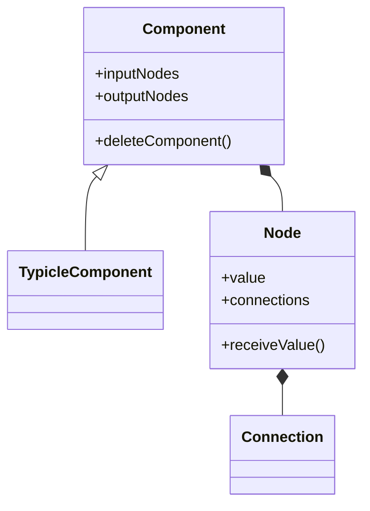

ShapeShift Playground is designed to make graphic and motion design accessible and enjoyable for all. Beyond just drawing, you can use it to construct personalized calculators or simulate mathematical function graphs, expanding the realms of design and calculation to suit your creative needs.

## To Run the Code
- Include CMU Graphics in the file [What is CMU Graphic?](https://academy.cs.cmu.edu/desktop)
- Then run the main.py

## Features

**Components**
- 🔷 Geometry: Circle, Rectangle
- 🔢 Math: Slider 1D, Slider 2D, Add, Subtract, Multiply, Divide, Square, Square Root, Pi, Absolute
- ➡️ Vector: Point, Vector, VectorPreview
- 🔄 Manipulation: Move
- 🧐 Analyze: Panel, Distance

🏗 more under construction...

**Interaction**
- Drag & drop to create components
- Drag wiring node connections
- Multi-select and group movement
- Double-click deletion

**Interface**
- Component categories
- Display toggles
- Grid and axis system
- Realtime canvas

## Keyboard Shortcuts
| Key | Action                  |
|-----|-------------------------|
| S   | Create Slider1D         |
| C   | Create Circle           |
| R   | Create Rectangle        |
| P   | Create Point            |
| 2   | Create Slider2D         |
| V   | Create Vector           |
| M   | Move                    |
| D   | Distance                |

## Technical Design
- One-way data flow, responsive broadcasting from upper flow to lower
- Component inheritance hierarchy
- Event-driven interaction
- World coordinate system
- Standardized data presentation and propagation

## Data Flow

