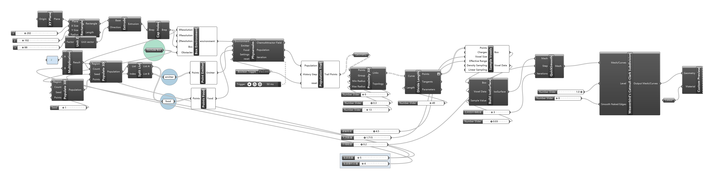
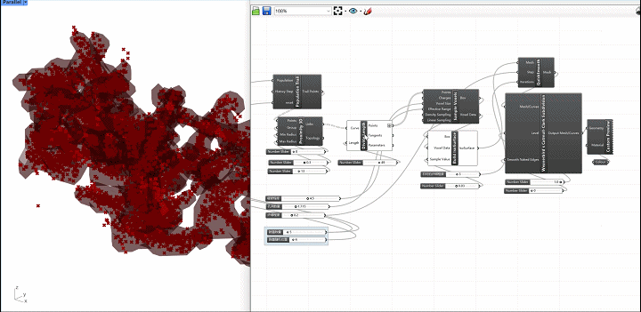
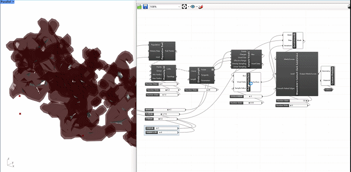
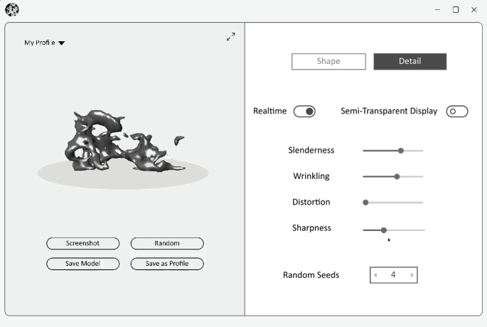

## Background
Traditional Taihu stone aesthetics emphasize "thinness (瘦), porosity (漏), transparency (透), and wrinkling (皱)" as core qualities. Algorithmic generation of such organic forms faces challenges in balancing parametric control with natural complexity. This project integrates procedural modeling and physical simulation to explore computational reinterpretations of this classical art form.

## Goal and workflow
To develop a parametric tool that dynamically adjusts the four key characteristics of Taihu stones, enabling designers to intuitively explore variations. The workflow combines physics-based point generation (PHYSAREALM) and mesh reconstruction (Chromodoris) to automate form-finding while preserving artistic intent.

## Grasshopper Implementation

<figure>
  
  <figcaption>grasshopper pipeline</figcaption>
</figure>

<figure>
  
  <figcaption>set boundary, food and emit</figcaption>
</figure>

<figure>
  
  <figcaption>Physarealm Simulation</figcaption>
</figure>
<figure>
  
  <figcaption>processing simulation output</figcaption>
</figure>
<figure>
  
  <figcaption>point to mesh</figcaption>
</figure>
<figure>
  
  <figcaption>mesh optimization</figcaption>
</figure>

<figure>
  
  <figcaption>parameter tweeking</figcaption>
</figure>

## GUIS

