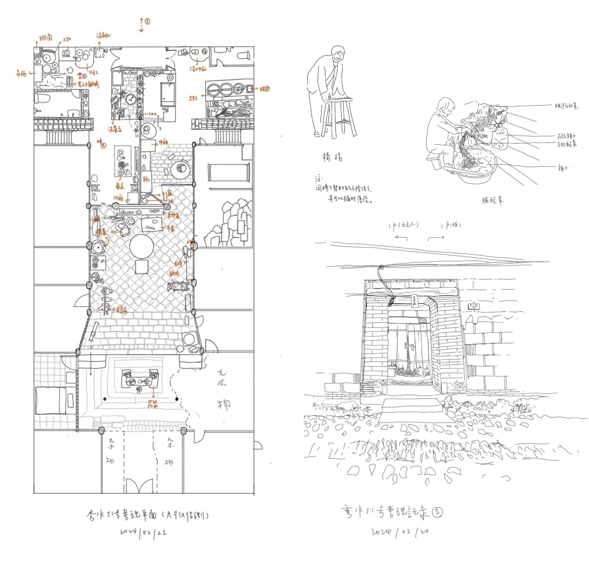
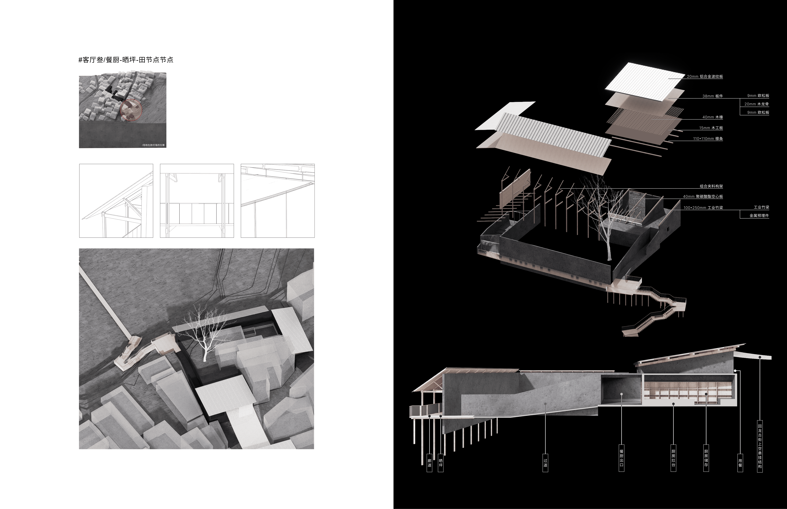

## Brief Introduction

Taking Huilong Village, Huilong Township, Jianyang City, Nanping City, Fujian Province as a case study, this paper deduces from macro to micro and examines the interaction between natural, clan, policy and other factors and the changes in the spatial pattern of Huilong Village, so as to complete the basic settlement cognition work. Focusing on the revival of public space at the entrance of Zhujia Alley in Henglong Ancient Street and the construction design of the Xiangxian Hall, it will bring reference for the current research and practice of rural rejuvenation.

My research work and design work are expanding in different scales. Due to the scale of the work content, it is hard to show all the details here, but my book gives a better sequential narrative in 5 chapters of the whole process.

Thanks to my advisor Dr. Luo's help during the whole process and Huilong Village government's assistance during our field research. I am also happy to stay and learn with our group in Fujian.

## RESEARCH
### Macro Scale
[谱系] The preface of the Hui Long Ye Clan Genealogy records: Fengling, commonly known as Henglong Street, was renamed Huilong Street during the Jiajing period. The village is built on a branch of Fengguan Ridge, surrounded by water on three sides (to the west lies Nanpu Creek, to the east lies Baimu Lotus Pond—also known as Ma Ye Pond, and to the south lies a large expanse of paddy fields in Guanjinglong). The terrain extends from east to southwest, winding downward into Nanpu, resembling a dragon emerging from the water, hence its name associated with a dragon. Observing the overall topography of the Nanpu Creek basin, the fourth geomorphic phase led to the development of numerous gullies and folds in this area. Mountains and rivers crisscross in a northeast-southwest orientation, forming longitudinal distributions. Erosion and deposition by water created broad valleys, which were occupied and developed into settlement clusters by migrants who began arriving twenty years after Emperor Wu of Han defeated Minyue. 

The Ye clan, as the founding lineage of Huilong Village, selected a site along Nanpu Creek based on geomantic principles and settled on the remnants of Fengling's ridges. While fully utilizing the advantages provided by the river—such as convenient water transportation, irrigation resources, and hydraulic power—the village also developed on relatively elevated terrain to reduce damage to fields, houses, and other structures caused by flooding from Nanpu Creek.

The major clans of Huilong Village were all noble families originating from the Central Plains in Henan, associated with officialdom and high-ranking status. In 885 CE, they migrated to Fujian alongside Wang Chao and his brothers Wang Shengui and Wang Shenzhi. Over time, these clans gradually settled in the Huilong area. Based on genealogical records from various clans, the routes of their migration into Fujian, the reasons for multiple relocations, and the names and official titles of their founding ancestors have been meticulously traced.
The migration of populations among villages in northern Fujian relied heavily on the interconnected water systems of Jianxi, Nanpu Creek, and Chongyang Creek. The primary reason for these migrations was the inability of the original settlements to sustain the rapidly growing populations. Consequently, these families followed the waterways to select new locations for settlement. This pattern reflects both the environmental constraints and strategic use of natural resources by these migrating communities.

As a multi-surname village, Huilong Village demonstrates a cohesive and orderly relationship both within and between clans during its development. However, the spatial social structure reveals competition and stratification among clans over productive resources. The Ye and Chi clans, being relatively prosperous, occupy the prime residential sites on Fengling Ridge. These locations offer superior views and have allowed these clans to construct ancestral halls, temples, opera stages, and schools, further reinforcing their social and cultural prominence.
In contrast, smaller clans such as the You, Cai, and Li families—primarily engaged in commerce along Nanpu Creek—settle in areas closer to the riverbanks. While these locations provide significant advantages in transportation and trade due to their proximity to waterways, they also expose these clans to the risks of flooding from Nanpu Creek. This spatial distribution reflects a layered social hierarchy where access to resources and security varies based on clan prosperity and settlement location.

### Mid Scale
[切片]-- [关节] Medium-scale "joints" in settlement “section” represent the most dynamic nodes of transformation, where their rise, decline, and nature continuously evolve. These nodes embody the interplay between top-down structural adjustments and bottom-up spontaneous activities that converge within the same spatial context at different times. This dual influence reflects both planned interventions and organic social dynamics shaping these spaces.

In the case of the entrance space of Zhujia Alley, the evolving spatial and social attributes have opened up new opportunities for redesign and renewal. Nearby hollowed-out residential areas and abandoned sites, which previously symbolized decline, are now being reimagined as spaces ripe for innovative development. This transformation highlights the potential to integrate these underutilized spaces into broader urban or rural revitalization efforts, addressing both functional needs and community aspirations.

I conducted research on the evolution of residential and public buildings in the entrance space of Zhujia Alley area since the 1970s, focusing on changes in kinship relationships and their impact on spatial transformations within certain residences. For a detailed case study, I selected the ancestral home of the Li family (#03 Tumu Residence) to investigate the kinship relationships of successive homeowners over time. This study aims to explore how familial ties influenced the spatial organization and utilization of this traditional residence, reflecting broader social and cultural dynamics in the area.

The rerouting of the ancient street in entrance space of Zhujia Alley coincided with the division of multi-child families into multiple nuclear families, leading to a fragmentation of the original residential fabric, akin to cellular division. This process not only altered the spatial organization of existing dwellings but also redefined the hierarchical structure of the roads. The differentiation of road levels significantly transformed the spatial attributes of entrance space of Zhujia Alley.

One notable outcome of this transformation is the creation of a setback space at the intersection of three key roads near the Yang family residence. This newly formed space has become a central gathering point for villagers, serving as an area for entertainment and leisure. The evolution of this node reflects both the adaptive reuse of space and its social recontextualization, highlighting how spatial changes can foster communal interactions in a dynamically shifting settlement fabric.

### Micro Scale
Research at the micro-scale primarily involves on-site investigations, interviews, and surveying. Additionally, local timber factories were visited to understand the material processing workflow and the history of commercialization.

## Design
### Micro Scale
[居所] The guesthouse spaces caters to 乡贤 (local gentry) of all levels, alleviating the accommodation pressure on village residences when they return while also serving as a light tourism facility.

### Mid Scale

[客厅] The "living room", represented by three containers on the section, embodies different levels and characteristics of publicness.

### Macro Scale

## Postcards

## Slides & Book
