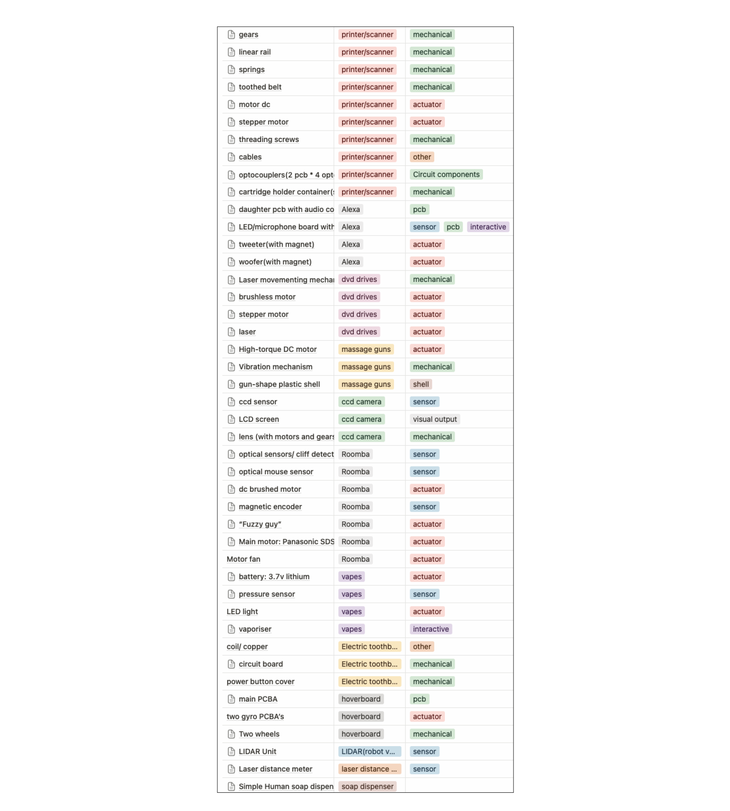

## PS3 Tear Down

<figure>
  
  <figcaption>A PS3's funeral. Hosted by Carla, Ziru</figcaption>
</figure>

<figure>
  
  <figcaption>Disassembled Disk Drives</figcaption>
</figure>

## WasteStation
We build a notion database for mapping out all the possibilities and finding connections in between waste parts and potential new borns.

## Ladybug Scanner
[Ladybug Scanner](https://github.com/yuji3w/ladybug?tab=readme-ov-file) as a precedent.
<figure>
  
  <figcaption>Process</figcaption>
</figure>

<figure>
  
  <figcaption>New-borned Disk Drives</figcaption>
</figure>

<figure>
  
  <figcaption>Disk Drives -- > Scanner</figcaption>
</figure>

<figure>
  
  <figcaption>New-borned Scanner</figcaption>
</figure>

