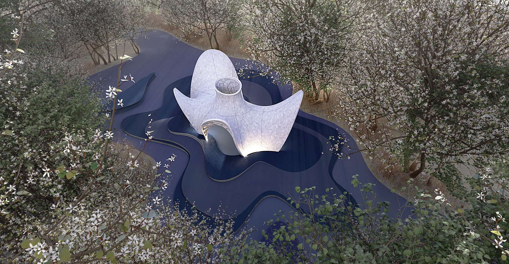
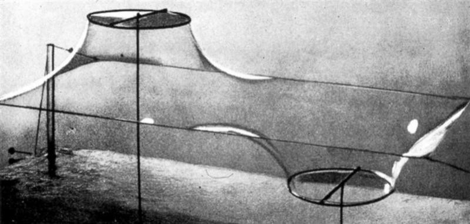
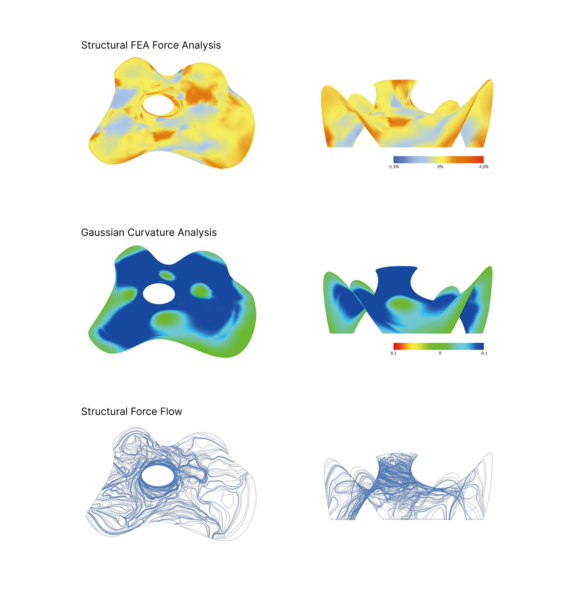
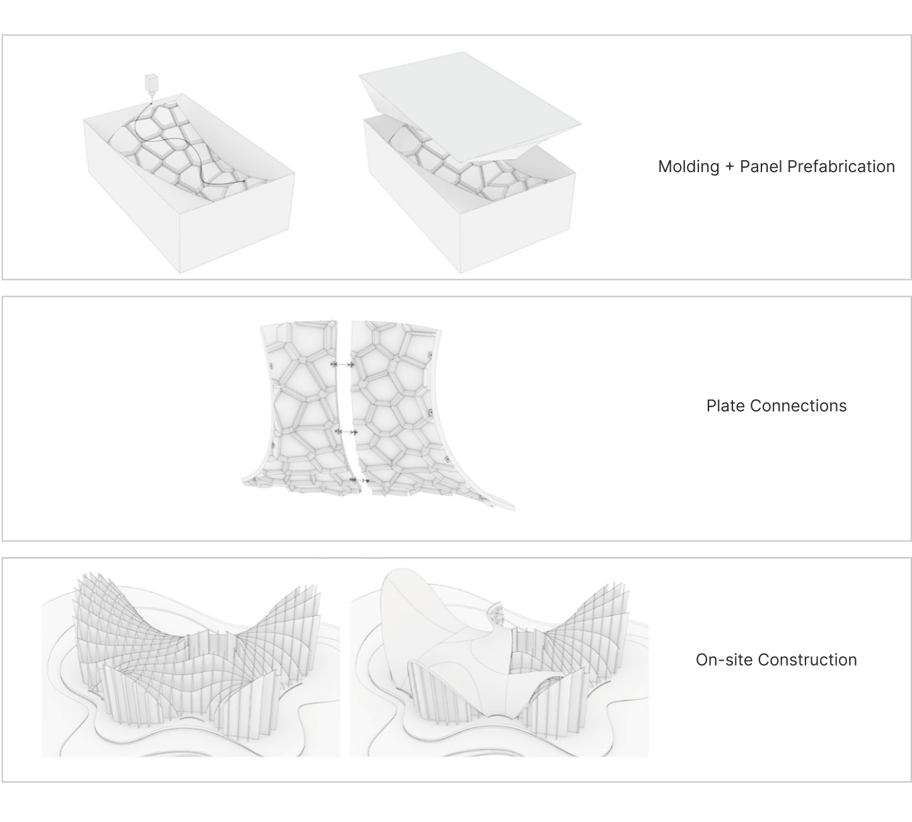
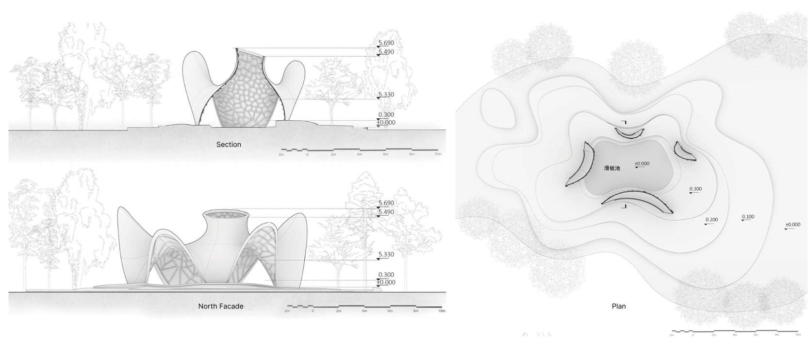
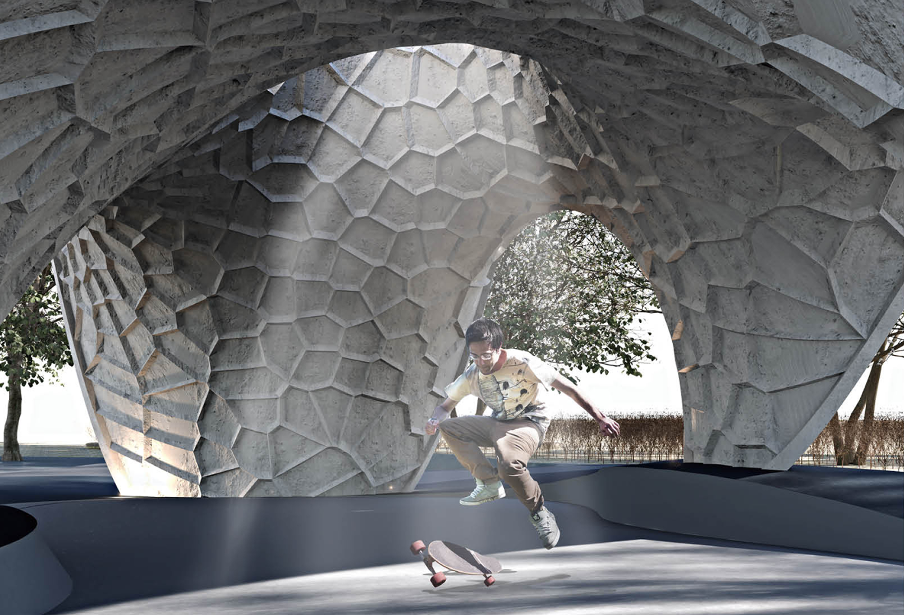
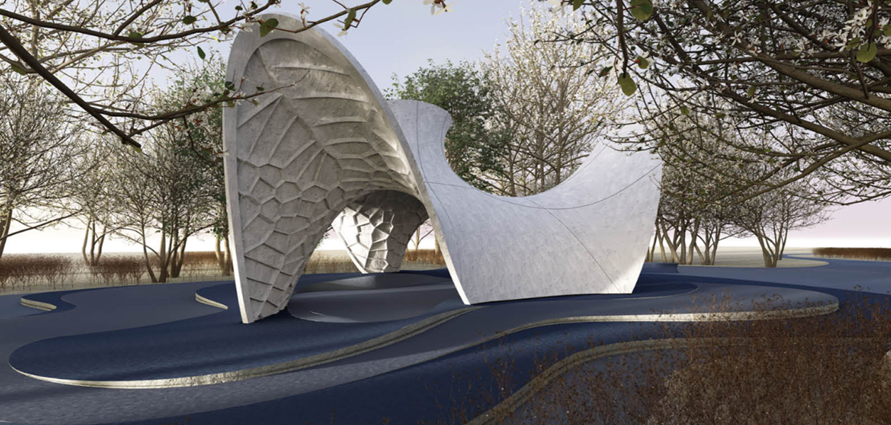

## Form Finding

Fun fact: When you blow a soap bubble, you're actually witnessing one of nature's most efficient structural systems in action!

Soap bubbles demonstrate nature's perfect engineering by automatically forming minimal surface areas with uniformly distributed tension, while organizing themselves into optimal shapes. These structures achieve remarkable efficiency by using the least amount of material to cover maximum space, similar to how a bubble creates the largest possible volume with minimal surface area. The resulting double-curved surfaces distribute loads evenly throughout the structure, providing natural stability without the need for additional reinforcement.

<figure>
  
  <figcaption>Frei Otto soap film model: early form finding method</figcaption>
</figure>

Inspired by this natural phenomenon, This project utilizes Kangaroo 2 physics simulation to digitally replicate the soap bubble's form-finding process. This computational approach allows us to discover optimal structural forms by simulating how forces would naturally shape our design, just as surface tension shapes a soap bubble.

To fit in the surrounding environment, a top curve and a spatial curve are first designed as the boundary of the shape. Then, a mesh is constructed according to these 2 curves. 2 arrays of points on the curves are selected as anchor targets, while another pairing 2 arrays of points on the mesh are selected as the anchor points. The mission of the anchor points is to pull the mesh towards the target. Meanwhile, the mesh is also subject to the gravity force with the specific material-related parameters.

## Analysis and Optimization

Now we have the basic form, the following step is to conduct a force flow analysis on the form surface to get the density distribution. Based on the resulting density distribution, ribs are added to the inner side of the surface to meet structural requirements with minimal weight.

## Proposed Fabrication Process

## Technical Drawings

## Renderings

